# Mermaid 图表示例集合

这个文档包含了各种 Mermaid 图表类型的示例，包括中文、英文、日文等多语言示例。

## 📊 目录
- [流程图 (Flowchart)](#流程图-flowchart)
- [序列图 (Sequence Diagram)](#序列图-sequence-diagram)
- [类图 (Class Diagram)](#类图-class-diagram)
- [状态图 (State Diagram)](#状态图-state-diagram)
- [实体关系图 (ER Diagram)](#实体关系图-er-diagram)
- [甘特图 (Gantt Chart)](#甘特图-gantt-chart)
- [饼图 (Pie Chart)](#饼图-pie-chart)
- [Git 图 (Git Graph)](#git-图-git-graph)
- [用户旅程图 (User Journey)](#用户旅程图-user-journey)
- [思维导图 (Mindmap)](#思维导图-mindmap)
- [时间线图 (Timeline)](#时间线图-timeline)

---

## 流程图 (Flowchart)

### 示例 1: 用户登录流程（中文）
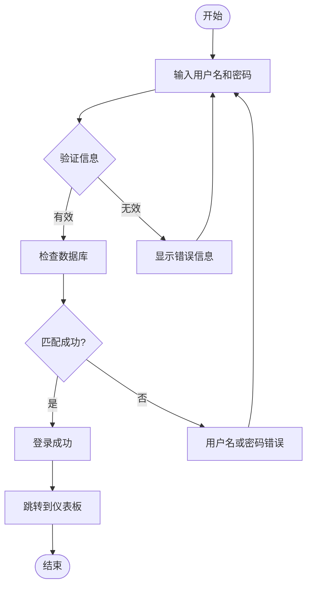
```mermaid
flowchart TD
    Start([开始]) --> Input[输入用户名和密码]
    Input --> Validate{验证信息}
    Validate -->|有效| CheckDB[检查数据库]
    Validate -->|无效| Error1[显示错误信息]
    Error1 --> Input
    CheckDB --> Match{匹配成功?}
    Match -->|是| Success[登录成功]
    Match -->|否| Error2[用户名或密码错误]
    Error2 --> Input
    Success --> Dashboard[跳转到仪表板]
    Dashboard --> End([结束])
```

### 示例 2: E-commerce Purchase Flow (English)
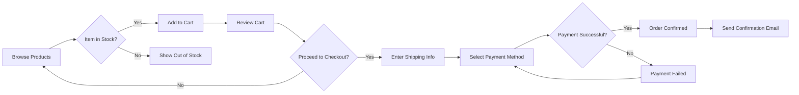
```mermaid
flowchart LR
    A[Browse Products] --> B{Item in Stock?}
    B -->|Yes| C[Add to Cart]
    B -->|No| D[Show Out of Stock]
    C --> E[Review Cart]
    E --> F{Proceed to Checkout?}
    F -->|Yes| G[Enter Shipping Info]
    F -->|No| A
    G --> H[Select Payment Method]
    H --> I{Payment Successful?}
    I -->|Yes| J[Order Confirmed]
    I -->|No| K[Payment Failed]
    K --> H
    J --> L[Send Confirmation Email]
```

### 示例 3: コーヒー注文プロセス（日本語）
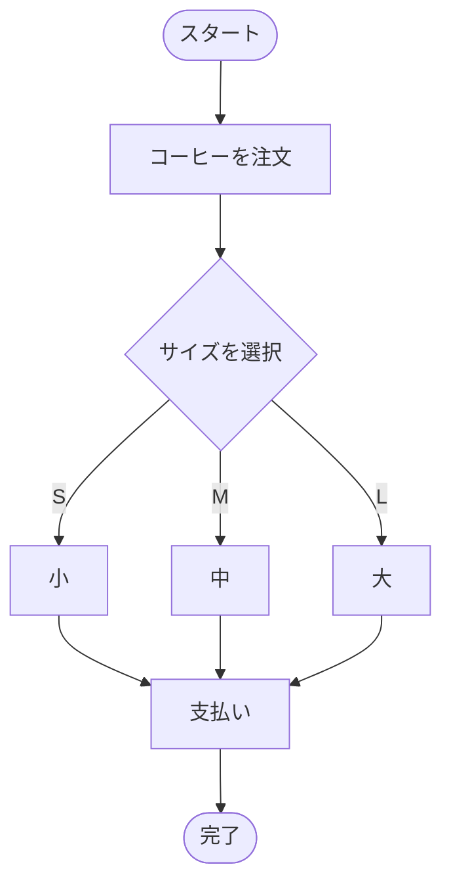
```mermaid
flowchart TD
    開始([スタート]) --> 注文[コーヒーを注文]
    注文 --> サイズ{サイズを選択}
    サイズ -->|S| 小
    サイズ -->|M| 中
    サイズ -->|L| 大
    小 --> 支払い[支払い]
    中 --> 支払い
    大 --> 支払い
    支払い --> 完了([完了])
```

### 示例 4: Algoritmo de Ordenación (Español)
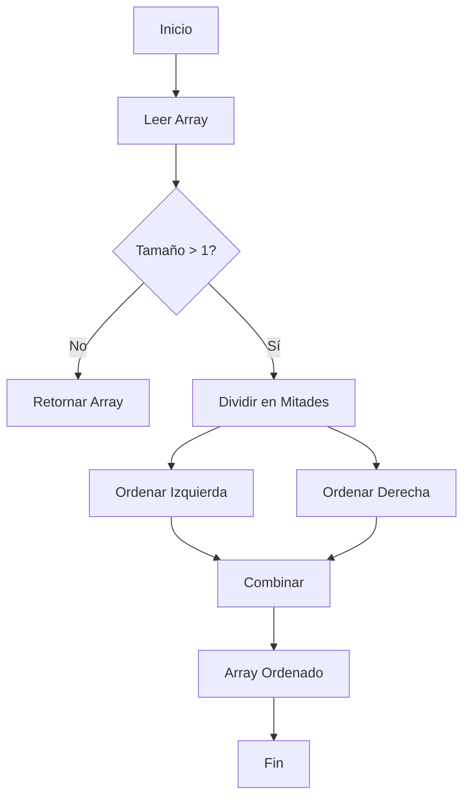
```mermaid
flowchart TD
    A[Inicio] --> B[Leer Array]
    B --> C{Tamaño > 1?}
    C -->|No| D[Retornar Array]
    C -->|Sí| E[Dividir en Mitades]
    E --> F[Ordenar Izquierda]
    E --> G[Ordenar Derecha]
    F --> H[Combinar]
    G --> H
    H --> I[Array Ordenado]
    I --> J[Fin]
```

---

## 序列图 (Sequence Diagram)

### 示例 1: 在线支付流程（中文）
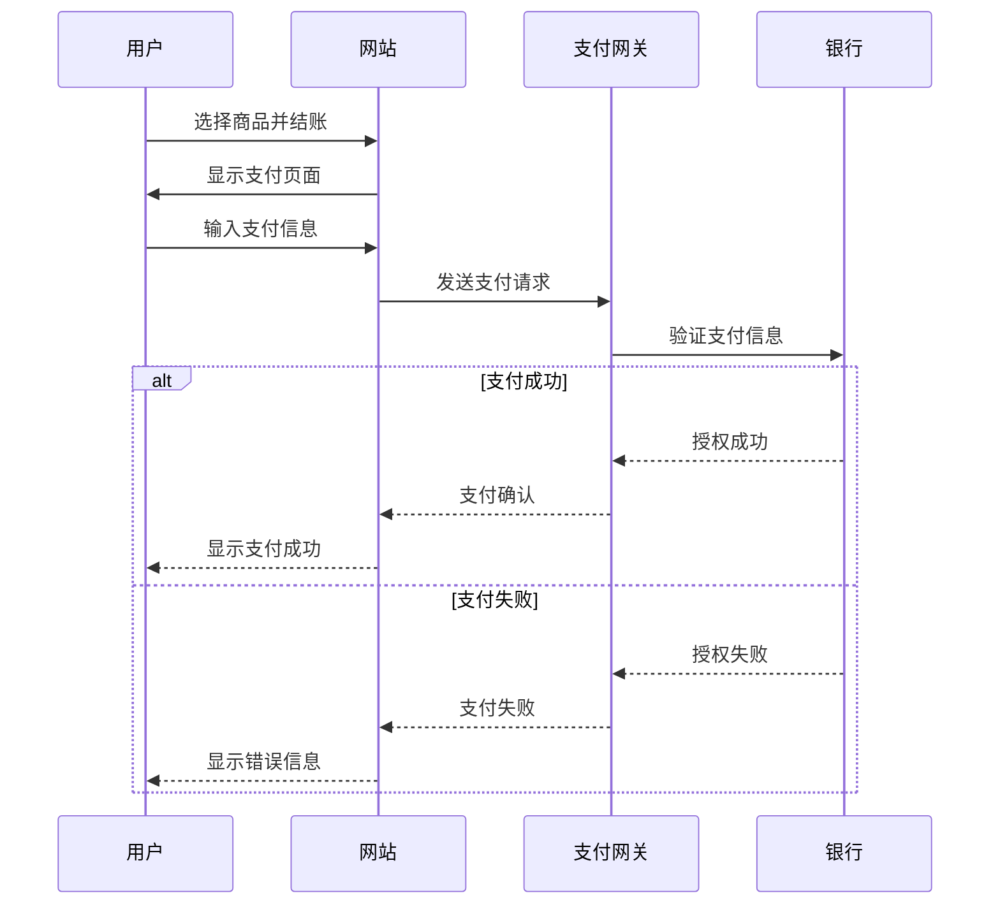
```mermaid
sequenceDiagram
    participant 用户
    participant 网站
    participant 支付网关
    participant 银行

    用户->>网站: 选择商品并结账
    网站->>用户: 显示支付页面
    用户->>网站: 输入支付信息
    网站->>支付网关: 发送支付请求
    支付网关->>银行: 验证支付信息
    
    alt 支付成功
        银行-->>支付网关: 授权成功
        支付网关-->>网站: 支付确认
        网站-->>用户: 显示支付成功
    else 支付失败
        银行-->>支付网关: 授权失败
        支付网关-->>网站: 支付失败
        网站-->>用户: 显示错误信息
    end
```

### 示例 2: API Authentication (English)
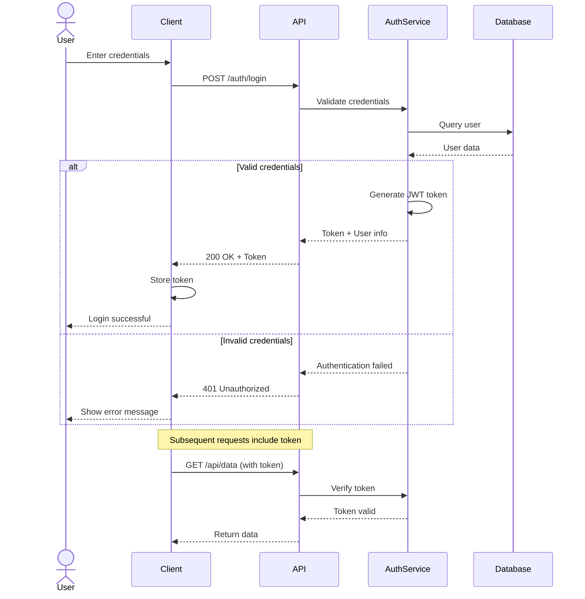
```mermaid
sequenceDiagram
    actor User
    participant Client
    participant API
    participant AuthService
    participant Database

    User->>Client: Enter credentials
    Client->>API: POST /auth/login
    API->>AuthService: Validate credentials
    AuthService->>Database: Query user
    Database-->>AuthService: User data
    
    alt Valid credentials
        AuthService->>AuthService: Generate JWT token
        AuthService-->>API: Token + User info
        API-->>Client: 200 OK + Token
        Client->>Client: Store token
        Client-->>User: Login successful
    else Invalid credentials
        AuthService-->>API: Authentication failed
        API-->>Client: 401 Unauthorized
        Client-->>User: Show error message
    end
    
    Note over Client,API: Subsequent requests include token
    Client->>API: GET /api/data (with token)
    API->>AuthService: Verify token
    AuthService-->>API: Token valid
    API-->>Client: Return data
```

### 示例 3: レストラン予約システム（日本語）
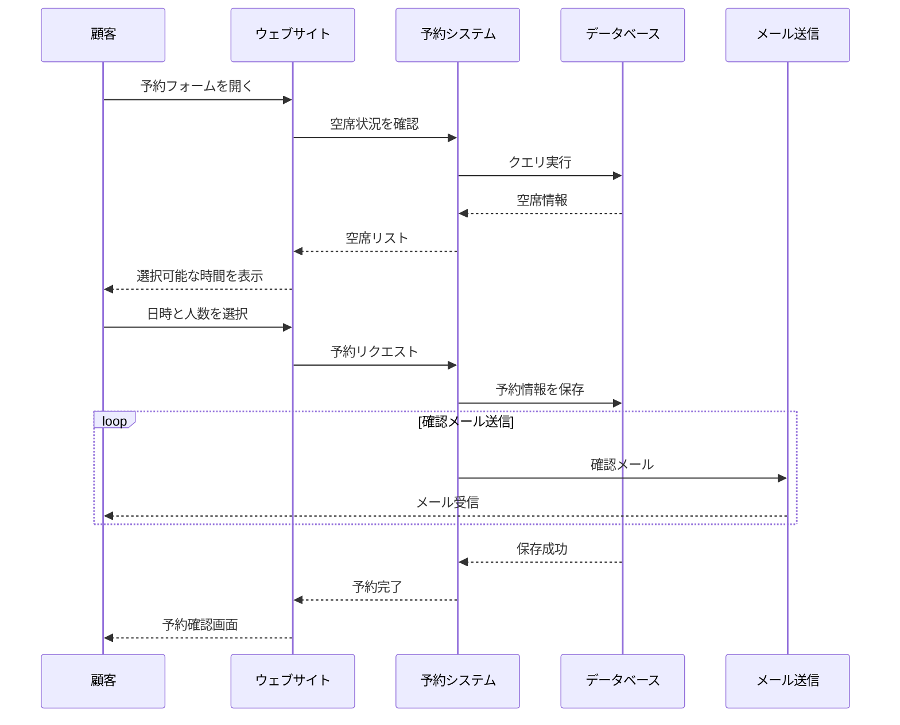
```mermaid
sequenceDiagram
    participant 顧客
    participant ウェブサイト
    participant 予約システム
    participant データベース
    participant メール送信

    顧客->>ウェブサイト: 予約フォームを開く
    ウェブサイト->>予約システム: 空席状況を確認
    予約システム->>データベース: クエリ実行
    データベース-->>予約システム: 空席情報
    予約システム-->>ウェブサイト: 空席リスト
    ウェブサイト-->>顧客: 選択可能な時間を表示
    
    顧客->>ウェブサイト: 日時と人数を選択
    ウェブサイト->>予約システム: 予約リクエスト
    予約システム->>データベース: 予約情報を保存
    
    loop 確認メール送信
        予約システム->>メール送信: 確認メール
        メール送信-->>顧客: メール受信
    end
    
    データベース-->>予約システム: 保存成功
    予約システム-->>ウェブサイト: 予約完了
    ウェブサイト-->>顧客: 予約確認画面
```

### 示例 4: Système de Chat (Français)
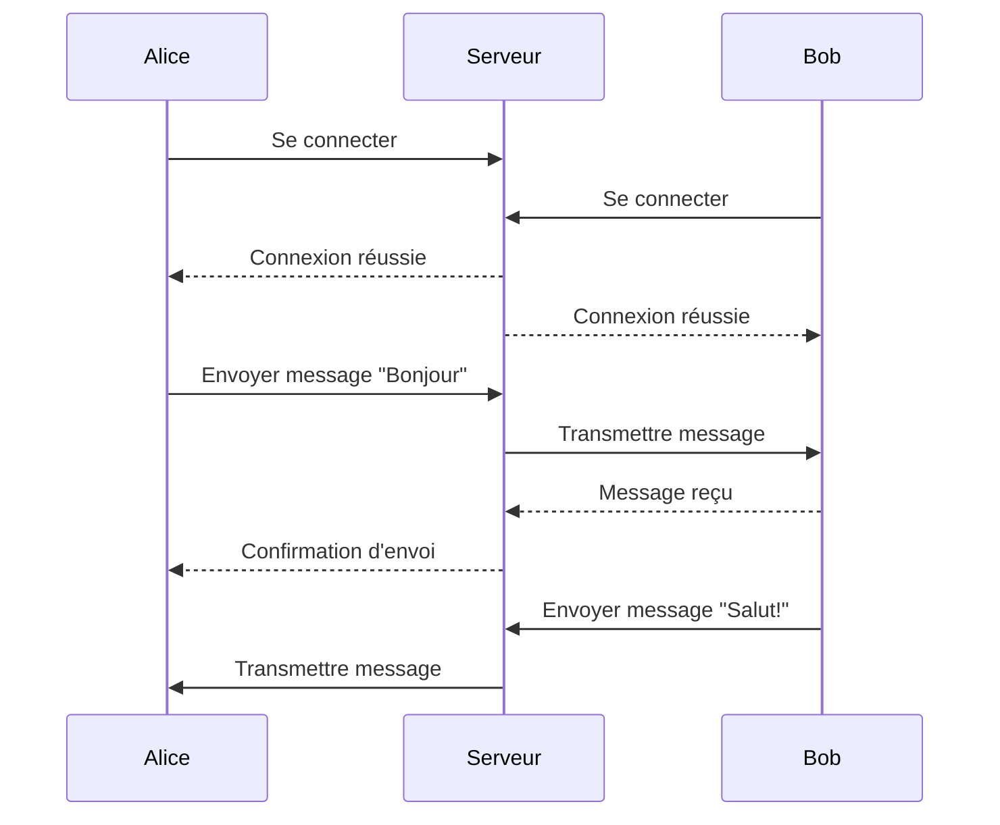
```mermaid
sequenceDiagram
    participant Alice
    participant Serveur
    participant Bob

    Alice->>Serveur: Se connecter
    Bob->>Serveur: Se connecter
    Serveur-->>Alice: Connexion réussie
    Serveur-->>Bob: Connexion réussie
    
    Alice->>Serveur: Envoyer message "Bonjour"
    Serveur->>Bob: Transmettre message
    Bob-->>Serveur: Message reçu
    Serveur-->>Alice: Confirmation d'envoi
    
    Bob->>Serveur: Envoyer message "Salut!"
    Serveur->>Alice: Transmettre message
```

---

## 类图 (Class Diagram)

### 示例 1: 电商系统（中文）
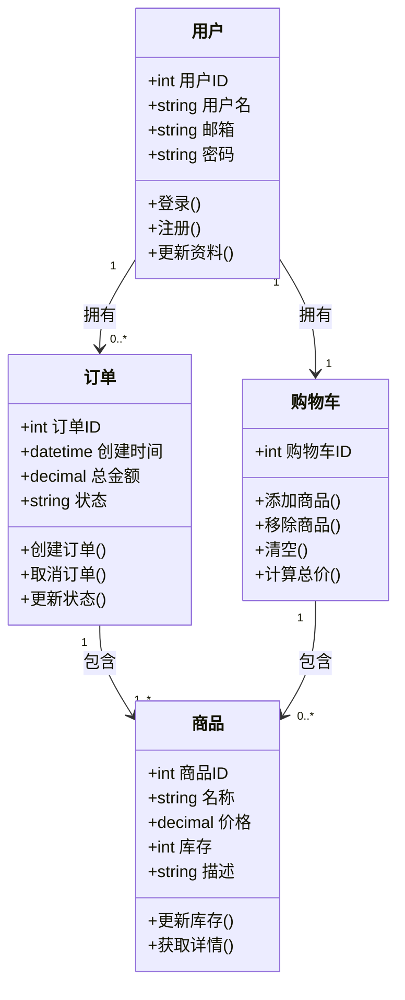
```mermaid
classDiagram
    class 用户 {
        +int 用户ID
        +string 用户名
        +string 邮箱
        +string 密码
        +登录()
        +注册()
        +更新资料()
    }
    
    class 商品 {
        +int 商品ID
        +string 名称
        +decimal 价格
        +int 库存
        +string 描述
        +更新库存()
        +获取详情()
    }
    
    class 订单 {
        +int 订单ID
        +datetime 创建时间
        +decimal 总金额
        +string 状态
        +创建订单()
        +取消订单()
        +更新状态()
    }
    
    class 购物车 {
        +int 购物车ID
        +添加商品()
        +移除商品()
        +清空()
        +计算总价()
    }
    
    用户 "1" --> "0..*" 订单 : 拥有
    用户 "1" --> "1" 购物车 : 拥有
    订单 "1" --> "1..*" 商品 : 包含
    购物车 "1" --> "0..*" 商品 : 包含
```

### 示例 2: Library Management System (English)
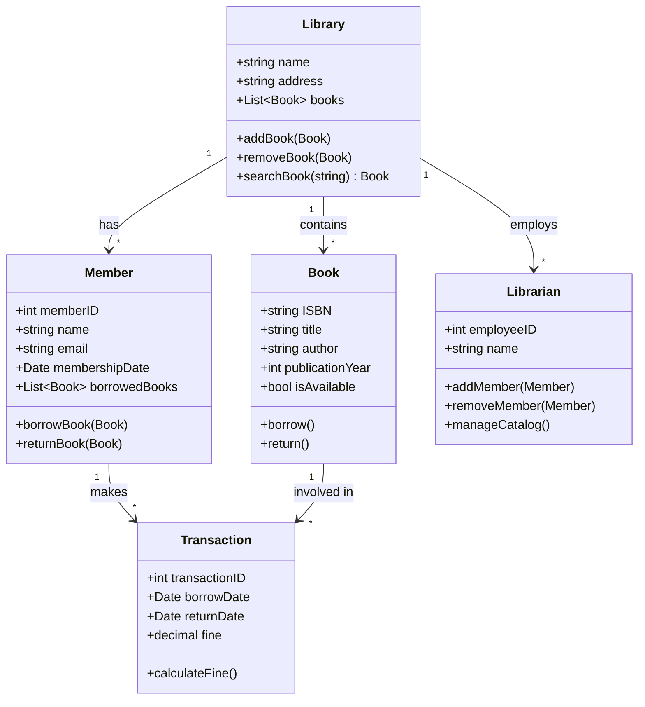
```mermaid
classDiagram
    class Library {
        +string name
        +string address
        +List~Book~ books
        +addBook(Book)
        +removeBook(Book)
        +searchBook(string) Book
    }
    
    class Book {
        +string ISBN
        +string title
        +string author
        +int publicationYear
        +bool isAvailable
        +borrow()
        +return()
    }
    
    class Member {
        +int memberID
        +string name
        +string email
        +Date membershipDate
        +List~Book~ borrowedBooks
        +borrowBook(Book)
        +returnBook(Book)
    }
    
    class Librarian {
        +int employeeID
        +string name
        +addMember(Member)
        +removeMember(Member)
        +manageCatalog()
    }
    
    class Transaction {
        +int transactionID
        +Date borrowDate
        +Date returnDate
        +decimal fine
        +calculateFine()
    }
    
    Library "1" --> "*" Book : contains
    Library "1" --> "*" Member : has
    Library "1" --> "*" Librarian : employs
    Member "1" --> "*" Transaction : makes
    Book "1" --> "*" Transaction : involved in
```

### 示例 3: ゲーム開発システム（日本語）
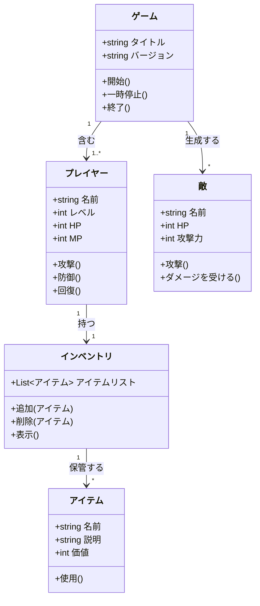
```mermaid
classDiagram
    class ゲーム {
        +string タイトル
        +string バージョン
        +開始()
        +一時停止()
        +終了()
    }
    
    class プレイヤー {
        +string 名前
        +int レベル
        +int HP
        +int MP
        +攻撃()
        +防御()
        +回復()
    }
    
    class 敵 {
        +string 名前
        +int HP
        +int 攻撃力
        +攻撃()
        +ダメージを受ける()
    }
    
    class アイテム {
        +string 名前
        +string 説明
        +int 価値
        +使用()
    }
    
    class インベントリ {
        +List~アイテム~ アイテムリスト
        +追加(アイテム)
        +削除(アイテム)
        +表示()
    }
    
    ゲーム "1" --> "1..*" プレイヤー : 含む
    ゲーム "1" --> "*" 敵 : 生成する
    プレイヤー "1" --> "1" インベントリ : 持つ
    インベントリ "1" --> "*" アイテム : 保管する
```

---

## 状态图 (State Diagram)

### 示例 1: 订单状态流转（中文）
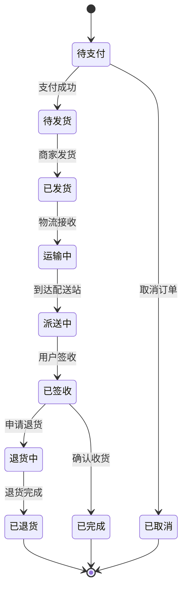
```mermaid
stateDiagram-v2
    [*] --> 待支付
    待支付 --> 已取消 : 取消订单
    待支付 --> 待发货 : 支付成功
    待发货 --> 已发货 : 商家发货
    已发货 --> 运输中 : 物流接收
    运输中 --> 派送中 : 到达配送站
    派送中 --> 已签收 : 用户签收
    已签收 --> 已完成 : 确认收货
    已签收 --> 退货中 : 申请退货
    退货中 --> 已退货 : 退货完成
    已退货 --> [*]
    已完成 --> [*]
    已取消 --> [*]
```

### 示例 2: Connection States (English)
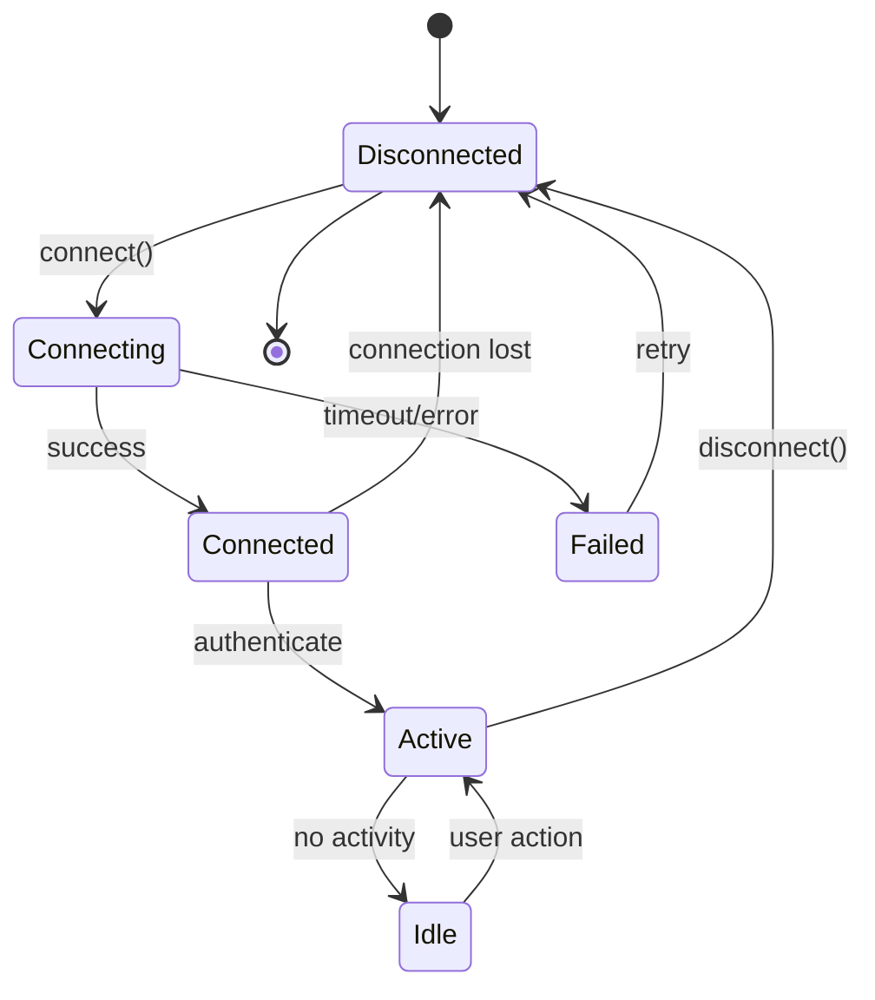
```mermaid
stateDiagram-v2
    [*] --> Disconnected
    Disconnected --> Connecting : connect()
    Connecting --> Connected : success
    Connecting --> Failed : timeout/error
    Failed --> Disconnected : retry
    Connected --> Active : authenticate
    Active --> Idle : no activity
    Idle --> Active : user action
    Active --> Disconnected : disconnect()
    Connected --> Disconnected : connection lost
    Disconnected --> [*]
```

### 示例 3: 自動販売機の状態（日本語）
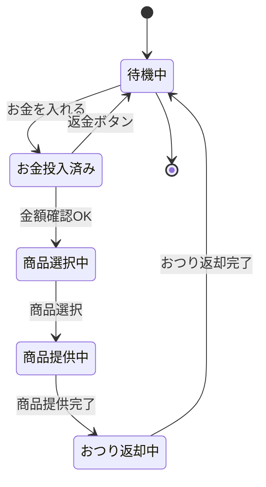
```mermaid
stateDiagram-v2
    [*] --> 待機中
    待機中 --> お金投入済み : お金を入れる
    お金投入済み --> 商品選択中 : 金額確認OK
    お金投入済み --> 待機中 : 返金ボタン
    商品選択中 --> 商品提供中 : 商品選択
    商品提供中 --> おつり返却中 : 商品提供完了
    おつり返却中 --> 待機中 : おつり返却完了
    待機中 --> [*]
```

---

## 实体关系图 (ER Diagram)

### 示例 1: 博客系统（中文）
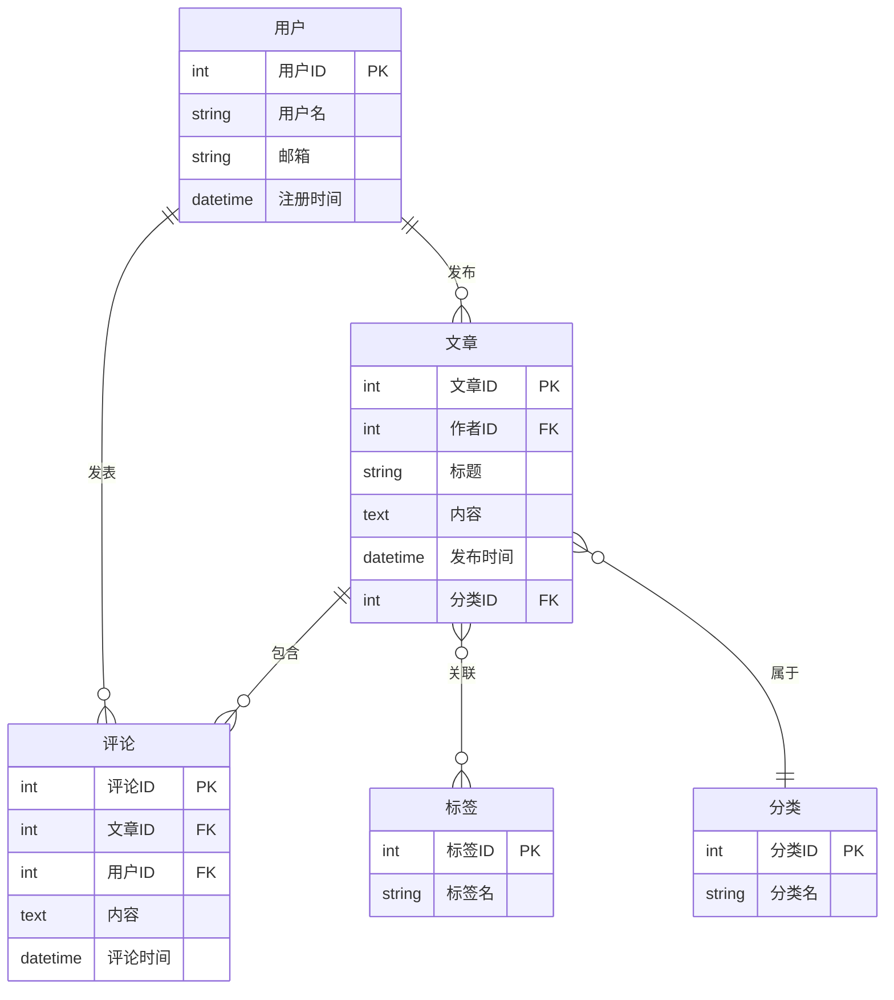
```mermaid
erDiagram
    用户 ||--o{ 文章 : 发布
    用户 ||--o{ 评论 : 发表
    文章 ||--o{ 评论 : 包含
    文章 }o--o{ 标签 : 关联
    文章 }o--|| 分类 : 属于
    
    用户 {
        int 用户ID PK
        string 用户名
        string 邮箱
        datetime 注册时间
    }
    
    文章 {
        int 文章ID PK
        int 作者ID FK
        string 标题
        text 内容
        datetime 发布时间
        int 分类ID FK
    }
    
    评论 {
        int 评论ID PK
        int 文章ID FK
        int 用户ID FK
        text 内容
        datetime 评论时间
    }
    
    标签 {
        int 标签ID PK
        string 标签名
    }
    
    分类 {
        int 分类ID PK
        string 分类名
    }
```

### 示例 2: School Database (English)
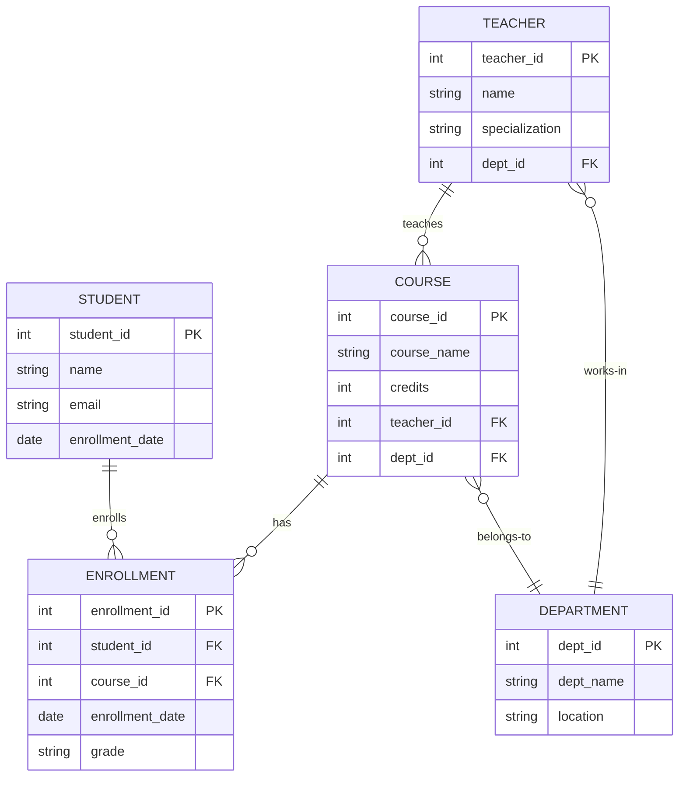
```mermaid
erDiagram
    STUDENT ||--o{ ENROLLMENT : enrolls
    COURSE ||--o{ ENROLLMENT : has
    COURSE }o--|| DEPARTMENT : belongs-to
    TEACHER ||--o{ COURSE : teaches
    TEACHER }o--|| DEPARTMENT : works-in
    
    STUDENT {
        int student_id PK
        string name
        string email
        date enrollment_date
    }
    
    COURSE {
        int course_id PK
        string course_name
        int credits
        int teacher_id FK
        int dept_id FK
    }
    
    ENROLLMENT {
        int enrollment_id PK
        int student_id FK
        int course_id FK
        date enrollment_date
        string grade
    }
    
    TEACHER {
        int teacher_id PK
        string name
        string specialization
        int dept_id FK
    }
    
    DEPARTMENT {
        int dept_id PK
        string dept_name
        string location
    }
```

---

## 甘特图 (Gantt Chart)

### 示例 1: 网站开发项目（中文）
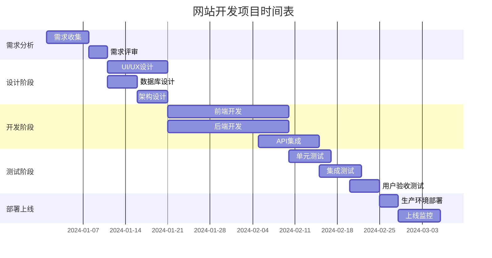
```mermaid
gantt
    title 网站开发项目时间表
    dateFormat YYYY-MM-DD
    section 需求分析
    需求收集           :a1, 2024-01-01, 7d
    需求评审           :after a1, 3d
    section 设计阶段
    UI/UX设计          :2024-01-11, 10d
    数据库设计         :2024-01-11, 5d
    架构设计           :2024-01-16, 5d
    section 开发阶段
    前端开发           :2024-01-21, 20d
    后端开发           :2024-01-21, 20d
    API集成            :2024-02-05, 10d
    section 测试阶段
    单元测试           :2024-02-10, 7d
    集成测试           :2024-02-15, 7d
    用户验收测试       :2024-02-20, 5d
    section 部署上线
    生产环境部署       :2024-02-25, 3d
    上线监控           :2024-02-28, 7d
```

### 示例 2: Product Launch (English)
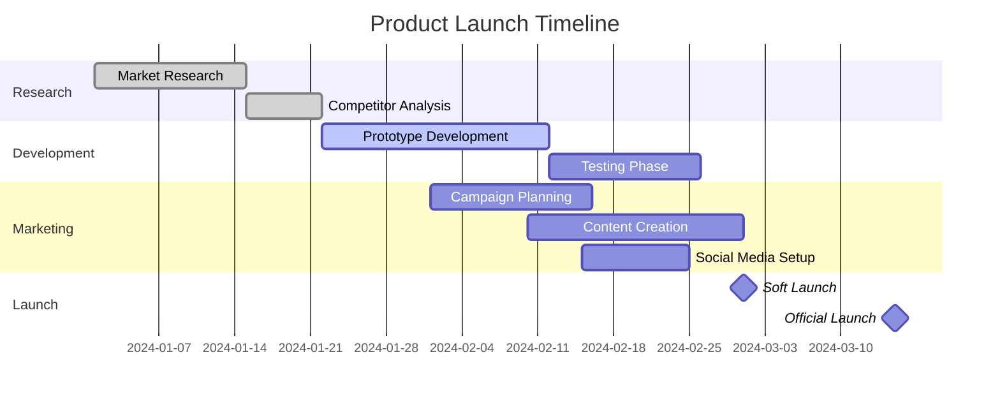
```mermaid
gantt
    title Product Launch Timeline
    dateFormat YYYY-MM-DD
    section Research
    Market Research        :done, a1, 2024-01-01, 14d
    Competitor Analysis    :done, after a1, 7d
    section Development
    Prototype Development  :active, 2024-01-22, 21d
    Testing Phase         :2024-02-12, 14d
    section Marketing
    Campaign Planning     :2024-02-01, 15d
    Content Creation      :2024-02-10, 20d
    Social Media Setup    :2024-02-15, 10d
    section Launch
    Soft Launch           :milestone, 2024-03-01, 0d
    Official Launch       :milestone, 2024-03-15, 0d
```

---

## 饼图 (Pie Chart)

### 示例 1: 市场份额（中文）
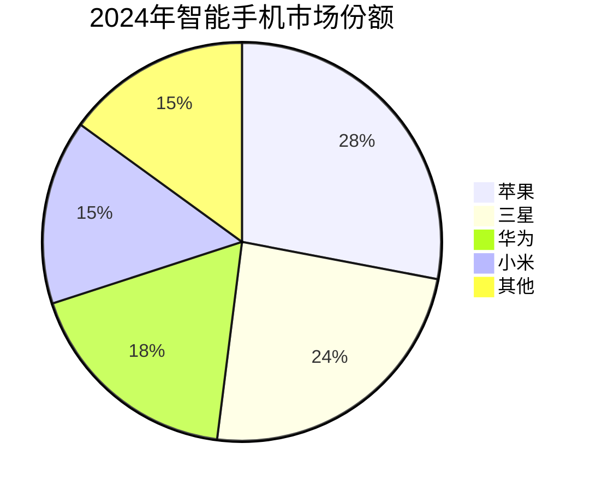
```mermaid
pie title 2024年智能手机市场份额
    "苹果" : 28
    "三星" : 24
    "华为" : 18
    "小米" : 15
    "其他" : 15
```

### 示例 2: Budget Distribution (English)
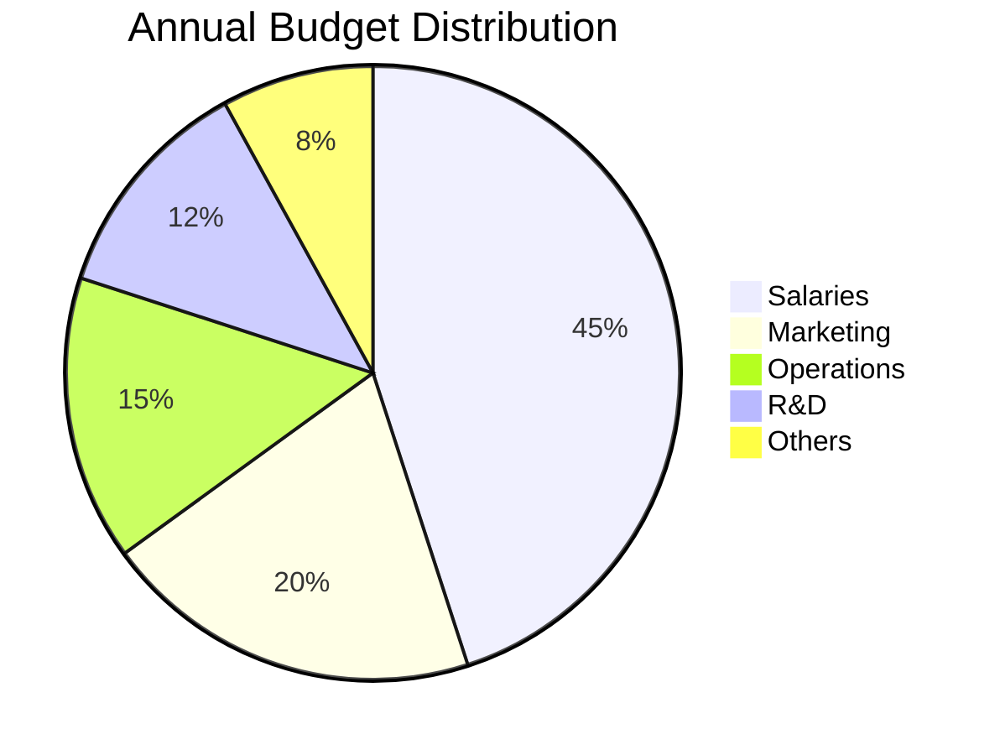
```mermaid
pie title Annual Budget Distribution
    "Salaries" : 45
    "Marketing" : 20
    "Operations" : 15
    "R&D" : 12
    "Others" : 8
```

### 示例 3: 時間の使い方（日本語）
```mermaid
pie title 一日の時間配分
    "睡眠" : 8
    "仕事" : 9
    "通勤" : 2
    "食事" : 2
    "自由時間" : 3
```

---

## Git 图 (Git Graph)

### 示例 1: 功能开发分支（中文）
```mermaid
gitGraph
    commit id: "初始化项目"
    commit id: "添加基础结构"
    branch 开发分支
    checkout 开发分支
    commit id: "添加登录功能"
    commit id: "添加注册功能"
    checkout main
    merge 开发分支
    branch 功能A
    checkout 功能A
    commit id: "开发功能A-1"
    commit id: "开发功能A-2"
    checkout main
    branch 功能B
    checkout 功能B
    commit id: "开发功能B"
    checkout main
    merge 功能A
    merge 功能B
    commit id: "发布v1.0"
```

### 示例 2: Release Flow (English)
```mermaid
gitGraph
    commit id: "Initial commit"
    commit id: "Add README"
    branch develop
    checkout develop
    commit id: "Feature: User auth"
    commit id: "Feature: Dashboard"
    branch feature/payment
    checkout feature/payment
    commit id: "Add payment gateway"
    commit id: "Add payment tests"
    checkout develop
    merge feature/payment
    checkout main
    merge develop tag: "v1.0.0"
    checkout develop
    commit id: "Bugfix: Login issue"
    checkout main
    merge develop tag: "v1.0.1"
```

---

## 用户旅程图 (User Journey)

### 示例 1: 在线购物体验（中文）
```mermaid
journey
    title 用户在线购物旅程
    section 浏览商品
      访问网站: 5: 用户
      搜索商品: 4: 用户
      查看详情: 5: 用户
    section 购买决策
      对比价格: 3: 用户
      查看评价: 4: 用户
      加入购物车: 5: 用户
    section 结账流程
      查看购物车: 5: 用户
      填写地址: 3: 用户
      选择支付: 4: 用户
      完成支付: 5: 用户
    section 售后服务
      等待发货: 3: 用户
      物流追踪: 4: 用户
      确认收货: 5: 用户
      评价商品: 4: 用户
```

### 示例 2: Mobile App Experience (English)
```mermaid
journey
    title User's Mobile Banking Experience
    section Account Access
      Open app: 5: User
      Biometric login: 5: User
      View dashboard: 5: User
    section Make Transaction
      Select transfer: 4: User
      Enter details: 3: User
      Confirm with OTP: 2: User
      Transaction complete: 5: User
    section Check History
      View transactions: 5: User
      Download statement: 4: User
```

---

## 思维导图 (Mindmap)

### 示例 1: 项目规划（中文）
```mermaid
mindmap
  root((网站开发项目))
    前端开发
      React框架
      组件设计
      状态管理
        Redux
        Context API
      样式方案
        Tailwind CSS
        CSS Modules
    后端开发
      Node.js
      Express框架
      数据库
        MongoDB
        PostgreSQL
      API设计
        RESTful API
        GraphQL
    部署运维
      CI/CD
        GitHub Actions
        Jenkins
      云服务
        AWS
        Azure
      监控
        日志管理
        性能监控
```

### 示例 2: Learning Path (English)
```mermaid
mindmap
  root((Web Development))
    Frontend
      HTML/CSS
      JavaScript
        ES6+
        TypeScript
      Frameworks
        React
        Vue
        Angular
    Backend
      Node.js
      Python
        Django
        Flask
      Database
        SQL
        NoSQL
    DevOps
      Docker
      Kubernetes
      CI/CD
```

---

## 时间线图 (Timeline)

### 示例 1: 公司发展历程（中文）
```mermaid
timeline
    title 公司发展历程
    2020 : 公司成立
         : 获得天使轮投资
    2021 : 产品上线
         : 用户突破10万
         : 完成A轮融资
    2022 : 开设海外办公室
         : 推出移动应用
         : 用户突破100万
    2023 : 完成B轮融资
         : 推出企业版
         : 获得行业大奖
    2024 : 上市准备
         : 全球扩张
```

### 示例 2: Product Evolution (English)
```mermaid
timeline
    title Product Development Timeline
    2022 Q1 : Concept & Research
            : Team Formation
    2022 Q2 : Prototype Development
            : User Testing
    2022 Q3 : Beta Launch
            : Feedback Integration
    2022 Q4 : Official Launch
            : Marketing Campaign
    2023 Q1 : Feature Updates
            : Mobile App Release
    2023 Q2 : International Expansion
            : 1M Users Milestone
```

---

## 高级示例

### 复杂流程图：软件开发生命周期（中文）
```mermaid
flowchart TB
    subgraph 需求阶段
        A[需求收集] --> B[需求分析]
        B --> C[需求评审]
    end
    
    subgraph 设计阶段
        D[系统设计] --> E[数据库设计]
        E --> F[接口设计]
    end
    
    subgraph 开发阶段
        G[编码实现] --> H[代码审查]
        H --> I[单元测试]
    end
    
    subgraph 测试阶段
        J[集成测试] --> K[系统测试]
        K --> L[UAT测试]
    end
    
    subgraph 部署阶段
        M[预生产部署] --> N[生产部署]
        N --> O[监控运维]
    end
    
    C --> D
    F --> G
    I --> J
    L --> M
    
    O --> P{需要更新?}
    P -->|是| A
    P -->|否| Q[持续运营]
    
    style 需求阶段 fill:#e1f5ff
    style 设计阶段 fill:#fff4e1
    style 开发阶段 fill:#e8f5e9
    style 测试阶段 fill:#fce4ec
    style 部署阶段 fill:#f3e5f5
```

### 微服务架构序列图 (English)
```mermaid
sequenceDiagram
    actor User
    participant Gateway as API Gateway
    participant Auth as Auth Service
    participant User Service
    participant Order Service
    participant Payment Service
    participant Notification Service
    participant Queue as Message Queue
    participant DB as Database

    User->>Gateway: POST /api/orders
    Gateway->>Auth: Verify JWT token
    Auth->>Auth: Validate token
    Auth-->>Gateway: Token valid
    
    Gateway->>Order Service: Create order
    Order Service->>DB: Check inventory
    DB-->>Order Service: Inventory available
    
    Order Service->>Payment Service: Process payment
    Payment Service->>Payment Service: Charge card
    
    alt Payment successful
        Payment Service-->>Order Service: Payment confirmed
        Order Service->>DB: Save order
        Order Service->>Queue: Publish order.created event
        Queue->>Notification Service: Consume event
        Notification Service->>User: Send confirmation email
        Order Service-->>Gateway: 201 Created
        Gateway-->>User: Order confirmed
    else Payment failed
        Payment Service-->>Order Service: Payment declined
        Order Service-->>Gateway: 400 Bad Request
        Gateway-->>User: Payment failed
    end
```

---

## 使用技巧

### 1. 子图 (Subgraphs)
使用子图可以更好地组织复杂的流程图：
```mermaid
flowchart TB
    subgraph 输入层
        A[输入A]
        B[输入B]
    end
    
    subgraph 处理层
        C[处理1]
        D[处理2]
    end
    
    subgraph 输出层
        E[输出]
    end
    
    A --> C
    B --> C
    C --> D
    D --> E
```

### 2. 样式自定义
可以为节点添加自定义样式：
```mermaid
flowchart LR
    A[Normal] --> B[Success]
    A --> C[Warning]
    A --> D[Error]
    
    classDef successStyle fill:#4caf50,stroke:#2e7d32,color:#fff
    classDef warningStyle fill:#ff9800,stroke:#f57c00,color:#fff
    classDef errorStyle fill:#f44336,stroke:#c62828,color:#fff
    
    class B successStyle
    class C warningStyle
    class D errorStyle
```

### 3. 注释和备注
使用 Note 添加说明：
```mermaid
sequenceDiagram
    participant A as 客户端
    participant B as 服务器
    
    A->>B: 请求数据
    Note right of B: 服务器处理请求<br/>验证权限<br/>查询数据库
    B-->>A: 返回结果
    Note over A,B: 整个过程需要<br/>200-300ms
```

---

## 建议

1. **保持简洁**：不要在一个图中放入太多信息
2. **使用中文字符**：Mermaid 完全支持中文、日文等多字节字符
3. **合理分组**：使用 subgraph 组织复杂的流程
4. **添加样式**：使用颜色和样式区分不同类型的节点
5. **注释说明**：适当添加 Note 帮助理解
6. **选择合适的图表类型**：根据实际需求选择最合适的图表

---

## 更多资源

- [Mermaid 官方文档](https://mermaid.js.org/)
- [Mermaid Live Editor](https://mermaid.live/)
- [语法速查表](https://mermaid.js.org/intro/syntax-reference.html)

