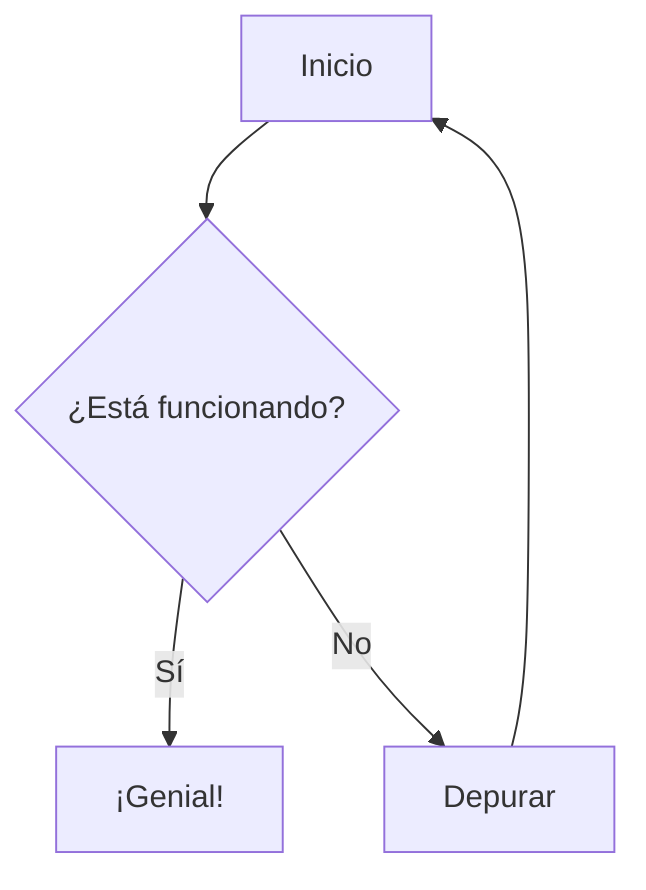

<div align="center">


<!-- 👆 Agregue la captura de pantalla del banner del proyecto aquí -->

[](https://modern-mermaid.live/)
[](https://discord.gg/tGxevHhz)
[](LICENSE)
[](https://reactjs.org/)
[](https://mermaid.js.org/)

**Un editor y visor de diagramas Mermaid.js moderno, potente y hermoso**

[English](README.md) | [简体中文](README.zh-CN.md) | [日本語](README.ja.md) | [Español](README.es.md) | [Português](README.pt.md)

[🎯 Características](#características) • [🚀 Inicio Rápido](#inicio-rápido) • [📖 Documentación](#documentación) • [🤝 Contribuir](#contribuir)

</div>

---

Experiencia en Vivo: [https://modern-mermaid.live/](https://modern-mermaid.live/)


<a name="features"></a>
<p align="right">(<a href="#readme-top">back to top</a>)</p>

## ✨ Características

### 🎨 **Temas Profesionales**
- **Más de 10 Temas Hermosos**: Linear Claro/Oscuro, Industrial, Dibujado a Mano, Studio Ghibli, Retro y más
- **Fondos Personalizados**: Degradados, colores sólidos y patrones
- **Selección de Fuentes**: Múltiples fuentes profesionales incluyendo Fira Code, JetBrains Mono y más
- **Modo Oscuro**: Soporte completo de modo oscuro con cambio automático de tema

### ⚡ **Editor Potente**
- **Resaltado de Sintaxis**: Resaltado de sintaxis Mermaid en tiempo real con palabras clave codificadas por colores
- **Números de Línea**: Numeración de líneas clara para fácil referencia
- **Autocompletado**: Sugerencias inteligentes para la sintaxis de Mermaid
- **Paneles Redimensionables**: Tamaños ajustables del editor y panel de vista previa

### 🖼️ **Exportación Avanzada**
- **Exportación de Alta Calidad**: Exportar diagramas en PNG (transparente) o JPG (con fondo)
- **Copia al Portapapeles**: Copiar diagramas al portapapeles con un clic con/sin fondo
- **Resolución Personalizada**: Exportar a 3x de resolución para imágenes cristalinas
- **Exportación por Lotes**: Exportar múltiples diagramas a la vez

### 🎯 **Herramientas de Anotación**
- **Herramientas de Dibujo**: Flechas, rectángulos, círculos, líneas y anotaciones de texto
- **Personalización de Colores**: Personalizar colores de anotación para que coincidan con tu tema
- **Soporte Multiidioma**: Interfaz disponible en 6 idiomas

### 🔧 **Funciones Interactivas**
- **Vista Previa en Vivo**: Renderizado en tiempo real mientras escribes
- **Escalado Automático**: Los diagramas se escalan automáticamente para ajustarse al viewport
- **Zoom y Panorámica**: Controles suaves de zoom y panorámica con mouse/trackpad
- **Modo Pantalla Completa**: Experiencia de edición sin distracciones
- **Coloración de Nodos**: Clic derecho en nodos para cambiar colores

### 📊 **Tipos de Diagramas Soportados**
- Diagramas de Flujo
- Diagramas de Secuencia
- Diagramas de Clases
- Diagramas de Estado
- Diagramas de Relación de Entidades
- Diagramas de Viaje de Usuario
- Gráficos de Gantt
- Gráficos de Pastel
- Gráficos Git
- Mapas Mentales
- Diagramas de Línea de Tiempo
- Gráficos de Cuadrante
- Gráficos XY
- ¡Y más!

---

## 🖼️ Capturas de Pantalla

<details>
<summary>Haga clic para expandir las capturas de pantalla</summary>

### Interfaz Principal

<!-- 👆 Agregue captura de pantalla de la interfaz principal -->

### Galería de Temas

<br/>

<table>
  <tr>
    <td width="33%"><a target="_blank" href="https://modern-mermaid.live/?theme=brutalist&example=flowchart-simple"></a><br/><b>Brutalist</b></td>
    <td width="33%"><a target="_blank" href="https://modern-mermaid.live/?theme=cyberpunk&example=sequence-payment"></a><br/><b>Cyberpunk</b></td>
    <td width="33%"><a target="_blank" href="https://modern-mermaid.live/?theme=ghibli&example=pie-market"></a><br/><b>Ghibli</b></td>
  </tr>
  <tr>
    <td><a target="_blank" href="https://modern-mermaid.live/?theme=memphis&example=flowchart-simple"></a><br/><b>Merphis</b></td>
    <td><a target="_blank" href="https://modern-mermaid.live/?theme=spotless&example=flowchart-simple"></a><br/><b>Spotless</b></td>
    <td><a target="_blank" href="https://modern-mermaid.live/?theme=handDrawn&example=pie-market"></a><br/><b>HandDrawn</b></td>
  </tr>
</table>

</details>

---

<a name="quick-start"></a>
<p align="right">(<a href="#readme-top">back to top</a>)</p>

## 🚀 Inicio Rápido

### Requisitos Previos

- Node.js 20.19+ o 22.12+
- npm, pnpm, o yarn

### Instalación

```bash
# Clonar el repositorio
git clone https://github.com/gotoailab/modern_mermaid.git
cd modern_mermaid

# Instalar dependencias (se recomienda usar pnpm)
pnpm install

# O usando npm
npm install

# O usando yarn
yarn install
```

### Desarrollo

```bash
# Iniciar servidor de desarrollo
pnpm dev

# La aplicación estará disponible en http://localhost:5173
```

### Compilación de Producción

```bash
# Compilar para producción
pnpm build

# Vista previa de compilación de producción
pnpm preview
```

---

## 🛠️ Stack Tecnológico

| Tecnología | Versión | Propósito |
|------------|---------|-----------|
| **React** | 19.2 | Framework de UI |
| **TypeScript** | 5.9 | Seguridad de Tipos |
| **Vite** | 7.2 | Herramienta de Compilación |
| **Tailwind CSS** | 4.1 | Estilos |
| **Mermaid.js** | 11.12 | Renderizado de Diagramas |
| **Lucide React** | 0.554 | Iconos |
| **html-to-image** | 1.11 | Exportación de Imágenes |

---

<a name="documentation"></a>
<p align="right">(<a href="#readme-top">back to top</a>)</p>

## 📖 Documentación

### Uso Básico

1. **Ingrese Código Mermaid**: Escriba su código de diagrama Mermaid en el panel del editor izquierdo
2. **Ver Vista Previa en Vivo**: El diagrama se renderiza en tiempo real a la derecha
3. **Personalizar**: Elija temas, fondos y fuentes desde la barra de herramientas
4. **Anotar**: Use herramientas de anotación para resaltar partes importantes
5. **Exportar**: Descargue o copie su diagrama en su formato preferido

### Atajos de Teclado

| Atajo | Acción |
|-------|--------|
| `Ctrl/Cmd + S` | Descargar diagrama |
| `Ctrl/Cmd + C` | Copiar al portapapeles |
| `Ctrl/Cmd + Z` | Deshacer |
| `Ctrl/Cmd + Y` | Rehacer |
| `Esc` | Salir de pantalla completa |

### Diagramas de Ejemplo



Más ejemplos disponibles en el [directorio de ejemplos](src/utils/examples.ts).

---

<a name="contributing"></a>
<p align="right">(<a href="#readme-top">back to top</a>)</p>

## 🤝 Contribuir

¡Nos encantan las contribuciones! Así es como puedes ayudar:

### Formas de Contribuir

- 🐛 **Reportar Errores**: Abrir un issue describiendo el error
- 💡 **Sugerir Características**: Comparte tus ideas para nuevas características
- 📝 **Mejorar Documentación**: Ayúdanos a mejorar nuestra documentación
- 🌍 **Traducciones**: Agregar soporte para más idiomas
- 💻 **Contribuciones de Código**: Enviar pull requests

### Proceso de Desarrollo

1. Fork el repositorio
2. Crear tu rama de características (`git checkout -b feature/CaracteristicaIncreible`)
3. Commit tus cambios (`git commit -m 'Agregar alguna CaracteristicaIncreible'`)
4. Push a la rama (`git push origin feature/CaracteristicaIncreible`)
5. Abrir un Pull Request

### Estilo de Código

- Seguir el estilo de código existente
- Ejecutar `pnpm lint` antes de hacer commit
- Escribir mensajes de commit significativos
- Agregar pruebas para nuevas características

---

## 🌟 Historial de Estrellas

[](https://star-history.com/#gotoailab/modern_mermaid&Date)

---

## 📄 Licencia

Este proyecto está licenciado bajo la Licencia MIT - ver el archivo [LICENSE](LICENSE) para más detalles.

---

## 🙏 Agradecimientos

- [Mermaid.js](https://mermaid.js.org/) - Biblioteca de diagramas increíble
- [React](https://reactjs.org/) - Framework de UI
- [Tailwind CSS](https://tailwindcss.com/) - Framework de estilos
- [Vite](https://vitejs.dev/) - Herramienta de compilación
- Todos nuestros [contribuidores](https://github.com/gotoailab/modern_mermaid/graphs/contributors)

---

## 📞 Contacto y Soporte

- 🌐 **Sitio Web**: [modern-mermaid.live](https://modern-mermaid.live/)
- 💬 **Discord**: [Únete a nuestra comunidad](https://discord.gg/tGxevHhz)
- 🐛 **Issues**: [GitHub Issues](https://github.com/gotoailab/modern_mermaid/issues)
- 📧 **Email**: support@gotoailab.com

---

<div align="center">

**Hecho con ❤️ por el Equipo de Modern Mermaid**

[⬆ Volver Arriba](#readme-top)

</div>

