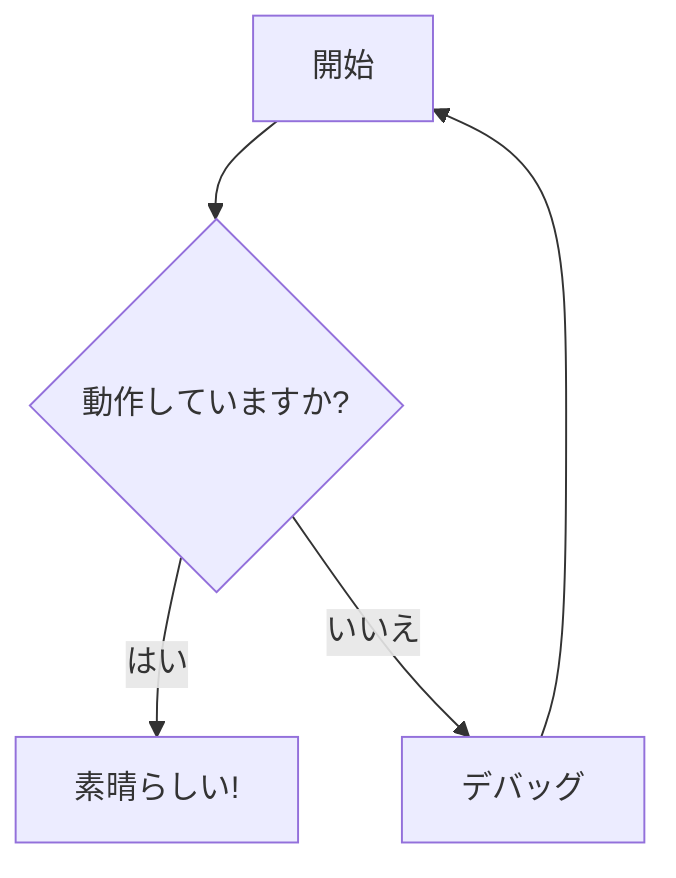

<a name="readme-top"></a>

<div align="center">


<!-- 👆 プロジェクトバナーのスクリーンショットをここに追加してください -->

[](https://modern-mermaid.live/)
[](https://discord.gg/tGxevHhz)
[](LICENSE)
[](https://reactjs.org/)
[](https://mermaid.js.org/)

**モダンで強力、そして美しい Mermaid.js ダイアグラムエディター＆プレビューアー**

[English](README.md) | [简体中文](README.zh-CN.md) | [日本語](README.ja.md) | [Español](README.es.md) | [Português](README.pt.md)

[🎯 機能](#機能) • [🚀 クイックスタート](#クイックスタート) • [📖 ドキュメント](#ドキュメント) • [🤝 コントリビューション](#コントリビューション)

</div>

---

ライブ体験: [https://modern-mermaid.live/](https://modern-mermaid.live/)


<a name="features"></a>
<p align="right">(<a href="#readme-top">back to top</a>)</p>

## ✨ 機能

### 🎨 **プロフェッショナルテーマ**
- **10以上の美しいテーマ**：リニアライト/ダーク、インダストリアル、手描き、スタジオジブリ、レトロなど
- **カスタム背景**：グラデーション、ソリッドカラー、パターン
- **フォント選択**：Fira Code、JetBrains Mono などの複数のプロフェッショナルフォント
- **ダークモード**：自動テーマ切り替えを備えた完全なダークモードサポート

### ⚡ **強力なエディター**
- **シンタックスハイライト**：リアルタイム Mermaid シンタックスハイライト、カラーコードされたキーワード
- **行番号**：参照しやすい明確な行番号
- **オートコンプリート**：Mermaid シンタックスのスマート提案
- **リサイズ可能なパネル**：エディターとプレビューペインのサイズ調整可能

### 🖼️ **高度なエクスポート**
- **高品質エクスポート**：PNG（透明）または JPG（背景付き）でダイアグラムをエクスポート
- **クリップボードコピー**：背景あり/なしでダイアグラムをクリップボードにワンクリックコピー
- **カスタム解像度**：3倍解像度でエクスポートし、クリスタルクリアな画像を取得
- **バッチエクスポート**：複数のダイアグラムを一度にエクスポート

### 🎯 **注釈ツール**
- **描画ツール**：矢印、長方形、円、線、テキスト注釈
- **色のカスタマイズ**：テーマに合わせて注釈の色をカスタマイズ
- **多言語サポート**：6言語で利用可能なインターフェース

### 🔧 **インタラクティブ機能**
- **ライブプレビュー**：入力するとリアルタイムでレンダリング
- **自動スケーリング**：ダイアグラムが自動的にビューポートに合わせてスケール
- **ズーム＆パン**：マウス/トラックパッドでスムーズなズームとパン制御
- **フルスクリーンモード**：集中できる編集体験
- **ノードの色付け**：ノードを右クリックして色を変更

### 📊 **サポートされているダイアグラムタイプ**
- フローチャート＆フロー図
- シーケンス図
- クラス図
- ステート図
- エンティティリレーションシップ図
- ユーザージャーニー図
- ガントチャート
- 円グラフ
- Git グラフ
- マインドマップ
- タイムライン図
- クアドラントチャート
- XY チャート
- さらに多数！

---

## 🖼️ スクリーンショット

<details>
<summary>スクリーンショットを展開</summary>

### メインインターフェース

<!-- 👆 メインインターフェースのスクリーンショットを追加してください -->

### テーマギャラリー

<br/>

<table>
  <tr>
    <td width="33%"><a target="_blank" href="https://modern-mermaid.live/?theme=brutalist&example=flowchart-simple"></a><br/><b>Brutalist</b></td>
    <td width="33%"><a target="_blank" href="https://modern-mermaid.live/?theme=cyberpunk&example=sequence-payment"></a><br/><b>Cyberpunk</b></td>
    <td width="33%"><a target="_blank" href="https://modern-mermaid.live/?theme=ghibli&example=pie-market"></a><br/><b>Ghibli</b></td>
  </tr>
  <tr>
    <td><a target="_blank" href="https://modern-mermaid.live/?theme=memphis&example=flowchart-simple"></a><br/><b>Merphis</b></td>
    <td><a target="_blank" href="https://modern-mermaid.live/?theme=spotless&example=flowchart-simple"></a><br/><b>Spotless</b></td>
    <td><a target="_blank" href="https://modern-mermaid.live/?theme=handDrawn&example=pie-market"></a><br/><b>HandDrawn</b></td>
  </tr>
</table>

</details>

---

<a name="quick-start"></a>
<p align="right">(<a href="#readme-top">back to top</a>)</p>

## 🚀 クイックスタート

### 前提条件

- Node.js 20.19+ または 22.12+
- npm、pnpm、または yarn

### インストール

```bash
# リポジトリをクローン
git clone https://github.com/gotoailab/modern_mermaid.git
cd modern_mermaid

# 依存関係をインストール（pnpm 推奨）
pnpm install

# または npm を使用
npm install

# または yarn を使用
yarn install
```

### 開発

```bash
# 開発サーバーを起動
pnpm dev

# アプリは http://localhost:5173 で利用可能になります
```

### 本番ビルド

```bash
# 本番用にビルド
pnpm build

# 本番ビルドをプレビュー
pnpm preview
```

---

## 🛠️ 技術スタック

| 技術 | バージョン | 目的 |
|------|-----------|------|
| **React** | 19.2 | UI フレームワーク |
| **TypeScript** | 5.9 | 型安全性 |
| **Vite** | 7.2 | ビルドツール |
| **Tailwind CSS** | 4.1 | スタイリング |
| **Mermaid.js** | 11.12 | ダイアグラムレンダリング |
| **Lucide React** | 0.554 | アイコン |
| **html-to-image** | 1.11 | 画像エクスポート |

---

<a name="documentation"></a>
<p align="right">(<a href="#readme-top">back to top</a>)</p>

## 📖 ドキュメント

### 基本的な使用方法

1. **Mermaid コードを入力**：左側のエディターパネルに Mermaid ダイアグラムコードを入力
2. **ライブプレビューを確認**：右側でダイアグラムがリアルタイムでレンダリング
3. **カスタマイズ**：ツールバーからテーマ、背景、フォントを選択
4. **注釈を追加**：注釈ツールを使用して重要な部分を強調
5. **エクスポート**：お好みの形式でダイアグラムをダウンロードまたはコピー

### キーボードショートカット

| ショートカット | アクション |
|---------------|----------|
| `Ctrl/Cmd + S` | ダイアグラムをダウンロード |
| `Ctrl/Cmd + C` | クリップボードにコピー |
| `Ctrl/Cmd + Z` | 元に戻す |
| `Ctrl/Cmd + Y` | やり直す |
| `Esc` | フルスクリーンを終了 |

### サンプルダイアグラム



その他の例は [examples ディレクトリ](src/utils/examples.ts) で利用可能です。

---

<a name="contributing"></a>
<p align="right">(<a href="#readme-top">back to top</a>)</p>

## 🤝 コントリビューション

私たちはコントリビューションを歓迎します！以下の方法でご協力いただけます：

### コントリビューション方法

- 🐛 **バグ報告**：バグを説明する issue を開く
- 💡 **機能提案**：新機能のアイデアを共有
- 📝 **ドキュメント改善**：ドキュメントの改善にご協力ください
- 🌍 **翻訳**：より多くの言語サポートを追加
- 💻 **コード貢献**：プルリクエストを送信

### 開発プロセス

1. リポジトリをフォーク
2. フィーチャーブランチを作成 (`git checkout -b feature/AmazingFeature`)
3. 変更をコミット (`git commit -m 'Add some AmazingFeature'`)
4. ブランチにプッシュ (`git push origin feature/AmazingFeature`)
5. プルリクエストを開く

### コードスタイル

- 既存のコードスタイルに従う
- コミット前に `pnpm lint` を実行
- 意味のあるコミットメッセージを書く
- 新機能にはテストを追加

---

## 🌟 Star 履歴

[](https://star-history.com/#gotoailab/modern_mermaid&Date)

---

## 📄 ライセンス

このプロジェクトは MIT ライセンスの下でライセンスされています - 詳細は [LICENSE](LICENSE) ファイルをご覧ください。

---

## 🙏 謝辞

- [Mermaid.js](https://mermaid.js.org/) - 素晴らしいダイアグラムライブラリ
- [React](https://reactjs.org/) - UI フレームワーク
- [Tailwind CSS](https://tailwindcss.com/) - スタイリングフレームワーク
- [Vite](https://vitejs.dev/) - ビルドツール
- すべての[コントリビューター](https://github.com/gotoailab/modern_mermaid/graphs/contributors)

---

## 📞 お問い合わせ＆サポート

- 🌐 **ウェブサイト**：[modern-mermaid.live](https://modern-mermaid.live/)
- 💬 **Discord**：[コミュニティに参加](https://discord.gg/tGxevHhz)
- 🐛 **Issues**：[GitHub Issues](https://github.com/gotoailab/modern_mermaid/issues)
- 📧 **メール**：support@gotoailab.com

---

<div align="center">

**Modern Mermaid チームが ❤️ を込めて制作**

[⬆ トップに戻る](#readme-top)

</div>

