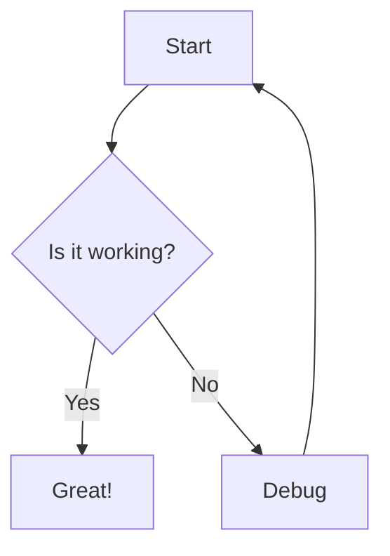

<a name="readme-top"></a>

<div align="center">


<!-- 👆 请在此处添加项目横幅截图 -->

[](https://modern-mermaid.live/)
[](https://discord.gg/tGxevHhz)
[](LICENSE)
[](https://reactjs.org/)
[](https://mermaid.js.org/)

**A modern, powerful, and beautiful Mermaid.js diagram editor and previewer**

[English](README.md) | [简体中文](README.zh-CN.md) | [日本語](README.ja.md) | [Español](README.es.md) | [Português](README.pt.md)

[🎯 Features](#features) • [🚀 Quick Start](#quick-start) • [📖 Documentation](#documentation) • [🤝 Contributing](#contributing)

<a href="https://www.producthunt.com/products/modern-mermaid?embed=true&utm_source=badge-featured&utm_medium=badge&utm_source=badge-modern&#0045;mermaid" target="_blank"></a>

</div>

---

Live Experience: [https://modern-mermaid.live/](https://modern-mermaid.live/)


<a name="features"></a>
<p align="right">(<a href="#readme-top">back to top</a>)</p>

## ✨ Features

### 🎨 **Professional Themes**
- **10+ Beautiful Themes**: Linear Light/Dark, Industrial, Hand Drawn, Studio Ghibli, Retro, and more
- **Custom Backgrounds**: Gradient, solid colors, and patterns
- **Font Selection**: Multiple professional fonts including Fira Code, JetBrains Mono, and more
- **Dark Mode**: Full dark mode support with automatic theme switching

### ⚡ **Powerful Editor**
- **Syntax Highlighting**: Real-time Mermaid syntax highlighting with color-coded keywords
- **Line Numbers**: Clear line numbering for easy reference
- **Auto-completion**: Smart suggestions for Mermaid syntax
- **Resizable Panels**: Adjustable editor and preview pane sizes

### 🖼️ **Advanced Export**
- **High-Quality Export**: Export diagrams in PNG (transparent) or JPG (with background)
- **Clipboard Copy**: One-click copy diagrams to clipboard with/without background
- **Custom Resolution**: Export at 3x resolution for crystal-clear images
- **Batch Export**: Export multiple diagrams at once

### 🎯 **Annotation Tools**
- **Drawing Tools**: Arrows, rectangles, circles, lines, and text annotations
- **Color Customization**: Customize annotation colors to match your theme
- **Multi-language Support**: Interface available in 6 languages

### 🔧 **Interactive Features**
- **Live Preview**: Real-time rendering as you type
- **Auto-scaling**: Diagrams automatically scale to fit the viewport
- **Zoom & Pan**: Smooth zoom and pan controls with mouse/trackpad
- **Fullscreen Mode**: Distraction-free editing experience
- **Node Coloring**: Right-click on nodes to change colors

### 📊 **Supported Diagram Types**
- Flowcharts & Flow Diagrams
- Sequence Diagrams
- Class Diagrams
- State Diagrams
- Entity Relationship Diagrams
- User Journey Diagrams
- Gantt Charts
- Pie Charts
- Git Graphs
- Mindmaps
- Timeline Diagrams
- Quadrant Charts
- XY Charts
- And more!

---

## 🖼️ Screenshots

<details>
<summary>Click to expand screenshots</summary>

### Main Interface

<!-- 👆 请添加主界面截图 -->

### Themes

<br/>

<table>
  <tr>
    <td width="33%"><a href="https://modern-mermaid.live/?c=OYJwhgDgFgBAKgEQFA1TAggbQBIFMA2%2BA9gLoprowC0VAfDAEKYCyRAJriAHZlqPV0YAYRacAtmACWbEkA&theme=brutalist&bg=default&font=default" target="_blank"></a><br/><b>Brutalist</b></td>
    <td width="33%"><a target="_blank" href="https://modern-mermaid.live/?theme=cyberpunk&example=sequence-payment"></a><br/><b>Cyberpunk</b></td>
    <td width="33%"><a target="_blank" href="https://modern-mermaid.live/?theme=ghibli&example=pie-market"></a><br/><b>Ghibli</b></td>
  </tr>
  <tr>
    <td><a target="_blank" href="https://modern-mermaid.live/?theme=memphis&example=flowchart-simple"></a><br/><b>Merphis</b></td>
    <td><a target="_blank" href="https://modern-mermaid.live/?theme=spotless&example=flowchart-simple"></a><br/><b>Spotless</b></td>
    <td><a target="_blank" href="https://modern-mermaid.live/?theme=handDrawn&example=pie-market"></a><br/><b>HandDrawn</b></td>
  </tr>
</table>

</details>

---

<a name="quick-start"></a>
<p align="right">(<a href="#readme-top">back to top</a>)</p>

## 🚀 Quick Start

### Prerequisites

- Node.js 20.19+ or 22.12+
- npm, pnpm, or yarn

### Installation

```bash
# Clone the repository
git clone https://github.com/gotoailab/modern_mermaid.git
cd modern_mermaid

# Install dependencies (using pnpm recommended)
pnpm install

# Or using npm
npm install

# Or using yarn
yarn install
```

### Development

```bash
# Start development server
pnpm dev

# The app will be available at http://localhost:5173
```

### Production Build

```bash
# Build for production
pnpm build

# Preview production build
pnpm preview
```

---

## 🛠️ Tech Stack

| Technology | Version | Purpose |
|------------|---------|---------|
| **React** | 19.2 | UI Framework |
| **TypeScript** | 5.9 | Type Safety |
| **Vite** | 7.2 | Build Tool |
| **Tailwind CSS** | 4.1 | Styling |
| **Mermaid.js** | 11.12 | Diagram Rendering |
| **Lucide React** | 0.554 | Icons |
| **html-to-image** | 1.11 | Image Export |

---

<a name="documentation"></a>
<p align="right">(<a href="#readme-top">back to top</a>)</p>

## 📖 Documentation

### Basic Usage

1. **Enter Mermaid Code**: Type your Mermaid diagram code in the left editor panel
2. **See Live Preview**: The diagram renders in real-time on the right
3. **Customize**: Choose themes, backgrounds, and fonts from the toolbar
4. **Annotate**: Use annotation tools to highlight important parts
5. **Export**: Download or copy your diagram in your preferred format

### Keyboard Shortcuts

| Shortcut | Action |
|----------|--------|
| `Ctrl/Cmd + S` | Download diagram |
| `Ctrl/Cmd + C` | Copy to clipboard |
| `Ctrl/Cmd + Z` | Undo |
| `Ctrl/Cmd + Y` | Redo |
| `Esc` | Exit fullscreen |

### Example Diagrams



More examples available in the [examples directory](src/utils/examples.ts).

---

<a name="contributing"></a>
<p align="right">(<a href="#readme-top">back to top</a>)</p>

## 🤝 Contributing

We love contributions! Here's how you can help:

### Ways to Contribute

- 🐛 **Report Bugs**: Open an issue describing the bug
- 💡 **Suggest Features**: Share your ideas for new features
- 📝 **Improve Documentation**: Help us improve our docs
- 🌍 **Translations**: Add support for more languages
- 💻 **Code Contributions**: Submit pull requests

### Development Process

1. Fork the repository
2. Create your feature branch (`git checkout -b feature/AmazingFeature`)
3. Commit your changes (`git commit -m 'Add some AmazingFeature'`)
4. Push to the branch (`git push origin feature/AmazingFeature`)
5. Open a Pull Request

### Code Style

- Follow the existing code style
- Run `pnpm lint` before committing
- Write meaningful commit messages
- Add tests for new features

---

## 🌟 Star History

[](https://star-history.com/#gotoailab/modern_mermaid&Date)

---

## 📄 License

This project is licensed under the MIT License - see the [LICENSE](LICENSE) file for details.

---

## 🙏 Acknowledgments

- [Mermaid.js](https://mermaid.js.org/) - Amazing diagram library
- [React](https://reactjs.org/) - UI framework
- [Tailwind CSS](https://tailwindcss.com/) - Styling framework
- [Vite](https://vitejs.dev/) - Build tool
- All our [contributors](https://github.com/gotoailab/modern_mermaid/graphs/contributors)

---

## 📞 Contact & Support

- 🌐 **Website**: [modern-mermaid.live](https://modern-mermaid.live/)
- 💬 **Discord**: [Join our community](https://discord.gg/tGxevHhz)
- 🐛 **Issues**: [GitHub Issues](https://github.com/gotoailab/modern_mermaid/issues)
- 📧 **Email**: chg80333@gmail.com
- 𝕏 **𝕏（Twitter）**: @chg80333

---

<div align="center">

**Made with ❤️ by the Modern Mermaid Team**

[⬆ Back to Top](#readme-top)

</div>
