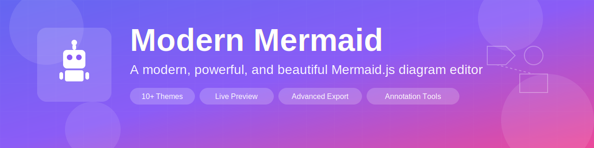
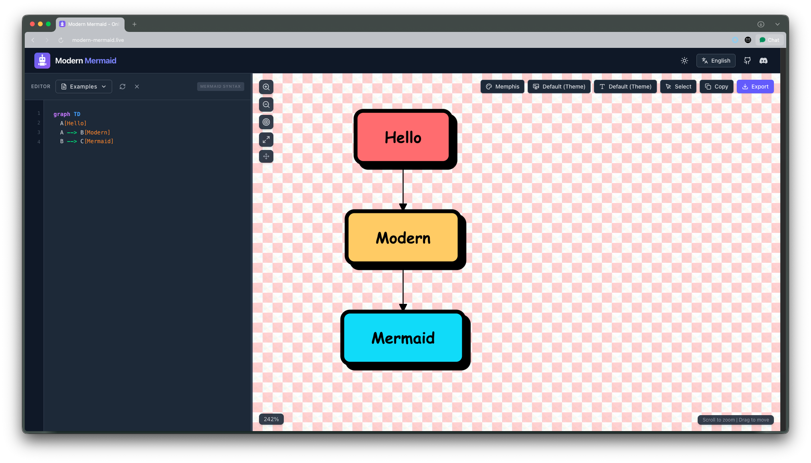
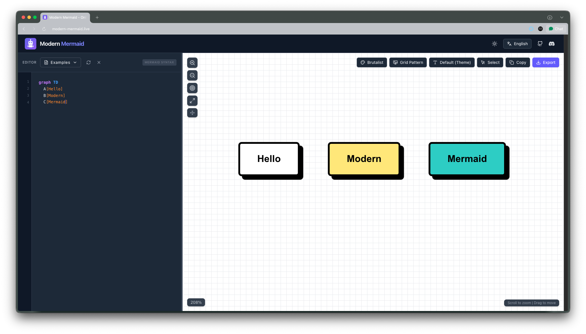
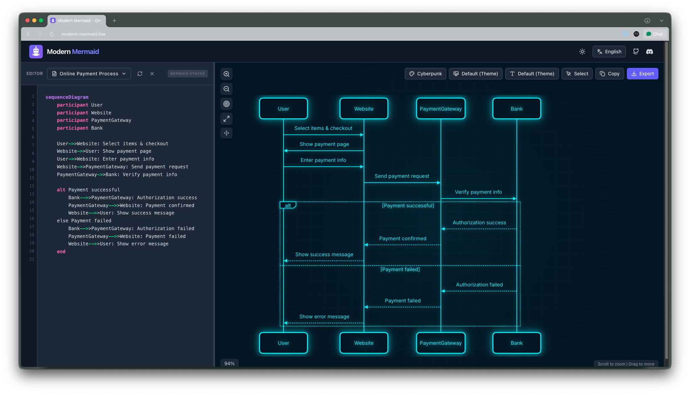
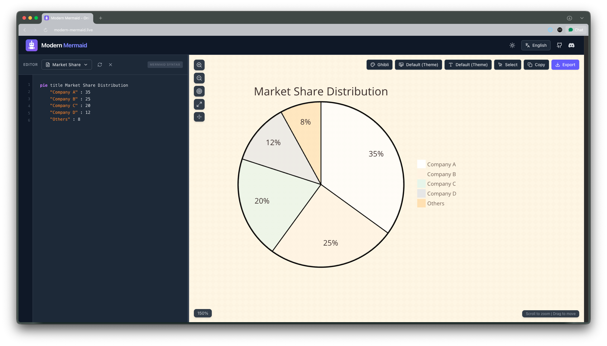
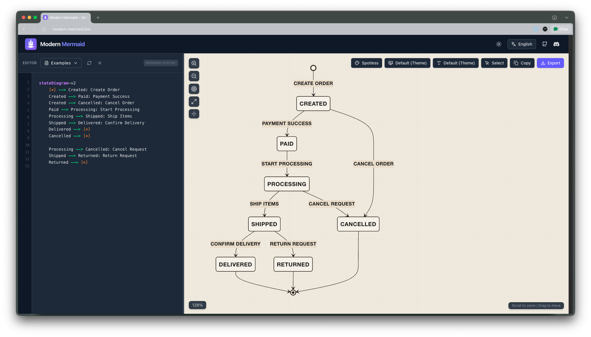
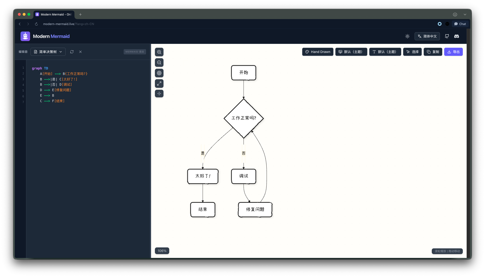
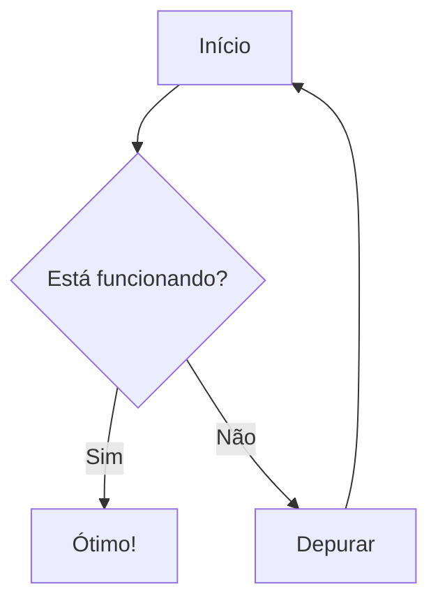

<a name="readme-top"></a>

<div align="center">


<!-- 👆 Adicione a captura de tela do banner do projeto aqui -->

[](https://modern-mermaid.live/)
[](https://discord.gg/tGxevHhz)
[](LICENSE)
[](https://reactjs.org/)
[](https://mermaid.js.org/)

**Um editor e visualizador de diagramas Mermaid.js moderno, poderoso e bonito**

[English](README.md) | [简体中文](README.zh-CN.md) | [日本語](README.ja.md) | [Español](README.es.md) | [Português](README.pt.md)

[🎯 Recursos](#recursos) • [🚀 Início Rápido](#início-rápido) • [📖 Documentação](#documentação) • [🤝 Contribuir](#contribuir)

</div>

---

Experiência ao Vivo: [https://modern-mermaid.live/](https://modern-mermaid.live/)



<a name="features"></a>
<p align="right">(<a href="#readme-top">back to top</a>)</p>

## ✨ Recursos

### 🎨 **Temas Profissionais**
- **Mais de 10 Temas Bonitos**: Linear Claro/Escuro, Industrial, Desenhado à Mão, Studio Ghibli, Retrô e mais
- **Fundos Personalizados**: Gradientes, cores sólidas e padrões
- **Seleção de Fontes**: Múltiplas fontes profissionais incluindo Fira Code, JetBrains Mono e mais
- **Modo Escuro**: Suporte completo ao modo escuro com mudança automática de tema

### ⚡ **Editor Poderoso**
- **Destaque de Sintaxe**: Destaque de sintaxe Mermaid em tempo real com palavras-chave codificadas por cores
- **Números de Linha**: Numeração de linhas clara para fácil referência
- **Autocompletar**: Sugestões inteligentes para sintaxe Mermaid
- **Painéis Redimensionáveis**: Tamanhos ajustáveis do editor e painel de visualização

### 🖼️ **Exportação Avançada**
- **Exportação de Alta Qualidade**: Exportar diagramas em PNG (transparente) ou JPG (com fundo)
- **Cópia para Área de Transferência**: Copiar diagramas para a área de transferência com um clique com/sem fundo
- **Resolução Personalizada**: Exportar em 3x de resolução para imagens cristalinas
- **Exportação em Lote**: Exportar múltiplos diagramas de uma vez

### 🎯 **Ferramentas de Anotação**
- **Ferramentas de Desenho**: Setas, retângulos, círculos, linhas e anotações de texto
- **Personalização de Cores**: Personalizar cores de anotação para combinar com seu tema
- **Suporte Multilíngue**: Interface disponível em 6 idiomas

### 🔧 **Recursos Interativos**
- **Visualização ao Vivo**: Renderização em tempo real enquanto você digita
- **Escala Automática**: Diagramas escalam automaticamente para ajustar ao viewport
- **Zoom e Pan**: Controles suaves de zoom e pan com mouse/trackpad
- **Modo Tela Cheia**: Experiência de edição sem distrações
- **Coloração de Nós**: Clique com botão direito nos nós para mudar cores

### 📊 **Tipos de Diagramas Suportados**
- Fluxogramas e Diagramas de Fluxo
- Diagramas de Sequência
- Diagramas de Classe
- Diagramas de Estado
- Diagramas de Relacionamento de Entidades
- Diagramas de Jornada do Usuário
- Gráficos de Gantt
- Gráficos de Pizza
- Gráficos Git
- Mapas Mentais
- Diagramas de Linha do Tempo
- Gráficos de Quadrante
- Gráficos XY
- E muito mais!

---

## 🖼️ Capturas de Tela

<details>
<summary>Clique para expandir as capturas de tela</summary>

### Interface Principal

<!-- 👆 Adicione captura de tela da interface principal -->

### Galeria de Temas

<br/>

<table>
  <tr>
    <td width="33%"><a target="_blank" href="https://modern-mermaid.live/?theme=brutalist&example=flowchart-simple"></a><br/><b>Brutalist</b></td>
    <td width="33%"><a target="_blank" href="https://modern-mermaid.live/?theme=cyberpunk&example=sequence-payment"></a><br/><b>Cyberpunk</b></td>
    <td width="33%"><a target="_blank" href="https://modern-mermaid.live/?theme=ghibli&example=pie-market"></a><br/><b>Ghibli</b></td>
  </tr>
  <tr>
    <td><a target="_blank" href="https://modern-mermaid.live/?theme=memphis&example=flowchart-simple"></a><br/><b>Merphis</b></td>
    <td><a target="_blank" href="https://modern-mermaid.live/?theme=spotless&example=flowchart-simple"></a><br/><b>Spotless</b></td>
    <td><a target="_blank" href="https://modern-mermaid.live/?theme=handDrawn&example=pie-market"></a><br/><b>HandDrawn</b></td>
  </tr>
</table>

</details>

---

<a name="quick-start"></a>
<p align="right">(<a href="#readme-top">back to top</a>)</p>

## 🚀 Início Rápido

### Pré-requisitos

- Node.js 20.19+ ou 22.12+
- npm, pnpm, ou yarn

### Instalação

```bash
# Clonar o repositório
git clone https://github.com/gotoailab/modern_mermaid.git
cd modern_mermaid

# Instalar dependências (recomenda-se usar pnpm)
pnpm install

# Ou usando npm
npm install

# Ou usando yarn
yarn install
```

### Desenvolvimento

```bash
# Iniciar servidor de desenvolvimento
pnpm dev

# O aplicativo estará disponível em http://localhost:5173
```

### Build de Produção

```bash
# Build para produção
pnpm build

# Visualizar build de produção
pnpm preview
```

---

## 🛠️ Stack de Tecnologia

| Tecnologia | Versão | Propósito |
|------------|--------|-----------|
| **React** | 19.2 | Framework de UI |
| **TypeScript** | 5.9 | Segurança de Tipos |
| **Vite** | 7.2 | Ferramenta de Build |
| **Tailwind CSS** | 4.1 | Estilos |
| **Mermaid.js** | 11.12 | Renderização de Diagramas |
| **Lucide React** | 0.554 | Ícones |
| **html-to-image** | 1.11 | Exportação de Imagens |

---

<a name="documentation"></a>
<p align="right">(<a href="#readme-top">back to top</a>)</p>

## 📖 Documentação

### Uso Básico

1. **Digite Código Mermaid**: Digite seu código de diagrama Mermaid no painel do editor esquerdo
2. **Veja Visualização ao Vivo**: O diagrama renderiza em tempo real à direita
3. **Personalizar**: Escolha temas, fundos e fontes da barra de ferramentas
4. **Anotar**: Use ferramentas de anotação para destacar partes importantes
5. **Exportar**: Baixe ou copie seu diagrama no formato preferido

### Atalhos de Teclado

| Atalho | Ação |
|--------|------|
| `Ctrl/Cmd + S` | Baixar diagrama |
| `Ctrl/Cmd + C` | Copiar para área de transferência |
| `Ctrl/Cmd + Z` | Desfazer |
| `Ctrl/Cmd + Y` | Refazer |
| `Esc` | Sair da tela cheia |

### Diagramas de Exemplo



Mais exemplos disponíveis no [diretório de exemplos](src/utils/examples.ts).

---

<a name="contributing"></a>
<p align="right">(<a href="#readme-top">back to top</a>)</p>

## 🤝 Contribuir

Adoramos contribuições! Veja como você pode ajudar:

### Formas de Contribuir

- 🐛 **Reportar Bugs**: Abra uma issue descrevendo o bug
- 💡 **Sugerir Recursos**: Compartilhe suas ideias para novos recursos
- 📝 **Melhorar Documentação**: Ajude-nos a melhorar nossa documentação
- 🌍 **Traduções**: Adicione suporte para mais idiomas
- 💻 **Contribuições de Código**: Envie pull requests

### Processo de Desenvolvimento

1. Fork o repositório
2. Crie sua branch de recurso (`git checkout -b feature/RecursoIncrivel`)
3. Commit suas mudanças (`git commit -m 'Adicionar algum RecursoIncrivel'`)
4. Push para a branch (`git push origin feature/RecursoIncrivel`)
5. Abra um Pull Request

### Estilo de Código

- Siga o estilo de código existente
- Execute `pnpm lint` antes de fazer commit
- Escreva mensagens de commit significativas
- Adicione testes para novos recursos

---

## 🌟 Histórico de Estrelas

[](https://star-history.com/#gotoailab/modern_mermaid&Date)

---

## 📄 Licença

Este projeto está licenciado sob a Licença MIT - veja o arquivo [LICENSE](LICENSE) para mais detalhes.

---

## 🙏 Agradecimentos

- [Mermaid.js](https://mermaid.js.org/) - Biblioteca de diagramas incrível
- [React](https://reactjs.org/) - Framework de UI
- [Tailwind CSS](https://tailwindcss.com/) - Framework de estilos
- [Vite](https://vitejs.dev/) - Ferramenta de build
- Todos os nossos [contribuidores](https://github.com/gotoailab/modern_mermaid/graphs/contributors)

---

## 📞 Contato e Suporte

- 🌐 **Site**: [modern-mermaid.live](https://modern-mermaid.live/)
- 💬 **Discord**: [Junte-se à nossa comunidade](https://discord.gg/tGxevHhz)
- 🐛 **Issues**: [GitHub Issues](https://github.com/gotoailab/modern_mermaid/issues)
- 📧 **Email**: support@gotoailab.com

---

<div align="center">

**Feito com ❤️ pela Equipe Modern Mermaid**

[⬆ Voltar ao Topo](#readme-top)

</div>

