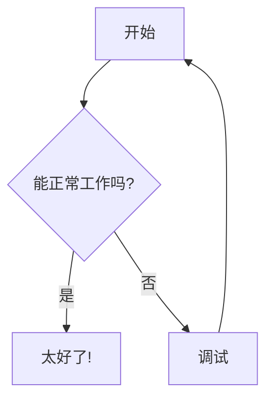

<a name="readme-top"></a>

<div align="center">


<!-- 👆 请在此处添加项目横幅截图 -->

[](https://modern-mermaid.live/)
[](https://discord.gg/tGxevHhz)
[](LICENSE)
[](https://reactjs.org/)
[](https://mermaid.js.org/)

**现代化、强大且美观的 Mermaid.js 图表编辑器和预览器**

[English](README.md) | [简体中文](README.zh-CN.md) | [日本語](README.ja.md) | [Español](README.es.md) | [Português](README.pt.md)

[🎯 特性](#特性) • [🚀 快速开始](#快速开始) • [📖 文档](#文档) • [🤝 贡献](#贡献)

</div>

---

在线体验: [https://modern-mermaid.live/](https://modern-mermaid.live/)


<a name="features"></a>
<p align="right">(<a href="#readme-top">back to top</a>)</p>

## ✨ 特性

### 🎨 **专业主题**
- **10+ 精美主题**：线性明/暗、工业风、手绘风、吉卜力风、复古风等
- **自定义背景**：渐变、纯色和图案
- **字体选择**：多种专业字体，包括 Fira Code、JetBrains Mono 等
- **深色模式**：完整的深色模式支持，自动主题切换

### ⚡ **强大编辑器**
- **语法高亮**：实时 Mermaid 语法高亮，关键字彩色标注
- **行号显示**：清晰的行号，便于引用
- **自动补全**：智能的 Mermaid 语法建议
- **可调整面板**：可调整编辑器和预览面板大小

### 🖼️ **高级导出**
- **高质量导出**：导出 PNG（透明）或 JPG（带背景）格式图表
- **剪贴板复制**：一键复制图表到剪贴板，可选带/不带背景
- **自定义分辨率**：3 倍分辨率导出，获得超清晰图像
- **批量导出**：一次导出多个图表

### 🎯 **标注工具**
- **绘图工具**：箭头、矩形、圆形、直线和文本标注
- **颜色自定义**：自定义标注颜色以匹配主题
- **多语言支持**：界面支持 6 种语言

### 🔧 **交互功能**
- **实时预览**：输入即渲染
- **自动缩放**：图表自动缩放以适应视口
- **缩放和平移**：使用鼠标/触控板平滑缩放和平移
- **全屏模式**：专注编辑体验
- **节点着色**：右键点击节点更改颜色

### 📊 **支持的图表类型**
- 流程图
- 时序图
- 类图
- 状态图
- 实体关系图
- 用户旅程图
- 甘特图
- 饼图
- Git 图
- 思维导图
- 时间轴图
- 象限图
- XY 图表
- 还有更多！

---

## 🖼️ 截图

<details>
<summary>点击展开截图</summary>

### 主界面

<!-- 👆 请添加主界面截图 -->

### 部分主题展示

<br/>

<table>
  <tr>
    <td width="33%"><a target="_blank" href="https://modern-mermaid.live/?theme=brutalist&example=flowchart-simple"></a><br/><b>Brutalist</b></td>
    <td width="33%"><a target="_blank" href="https://modern-mermaid.live/?theme=cyberpunk&example=sequence-payment"></a><br/><b>Cyberpunk</b></td>
    <td width="33%"><a target="_blank" href="https://modern-mermaid.live/?theme=ghibli&example=pie-market"></a><br/><b>Ghibli</b></td>
  </tr>
  <tr>
    <td><a target="_blank" href="https://modern-mermaid.live/?theme=memphis&example=flowchart-simple"></a><br/><b>Merphis</b></td>
    <td><a target="_blank" href="https://modern-mermaid.live/?theme=spotless&example=flowchart-simple"></a><br/><b>Spotless</b></td>
    <td><a target="_blank" href="https://modern-mermaid.live/?theme=handDrawn&example=pie-market"></a><br/><b>HandDrawn</b></td>
  </tr>
</table>

</details>

---

<a name="quick-start"></a>
<p align="right">(<a href="#readme-top">back to top</a>)</p>

## 🚀 快速开始

### 前置要求

- Node.js 20.19+ 或 22.12+
- npm、pnpm 或 yarn

### 安装

```bash
# 克隆仓库
git clone https://github.com/gotoailab/modern_mermaid.git
cd modern_mermaid

# 安装依赖（推荐使用 pnpm）
pnpm install

# 或使用 npm
npm install

# 或使用 yarn
yarn install
```

### 开发

```bash
# 启动开发服务器
pnpm dev

# 应用将在 http://localhost:5173 可用
```

### 生产构建

```bash
# 构建生产版本
pnpm build

# 预览生产构建
pnpm preview
```

---

## 🛠️ 技术栈

| 技术 | 版本 | 用途 |
|------|------|------|
| **React** | 19.2 | UI 框架 |
| **TypeScript** | 5.9 | 类型安全 |
| **Vite** | 7.2 | 构建工具 |
| **Tailwind CSS** | 4.1 | 样式 |
| **Mermaid.js** | 11.12 | 图表渲染 |
| **Lucide React** | 0.554 | 图标 |
| **html-to-image** | 1.11 | 图片导出 |

---

<a name="documentation"></a>
<p align="right">(<a href="#readme-top">back to top</a>)</p>

## 📖 文档

### 基本使用

1. **输入 Mermaid 代码**：在左侧编辑器面板中输入您的 Mermaid 图表代码
2. **查看实时预览**：图表在右侧实时渲染
3. **自定义**：从工具栏选择主题、背景和字体
4. **标注**：使用标注工具突出重要部分
5. **导出**：以您喜欢的格式下载或复制图表

### 键盘快捷键

| 快捷键 | 操作 |
|--------|------|
| `Ctrl/Cmd + S` | 下载图表 |
| `Ctrl/Cmd + C` | 复制到剪贴板 |
| `Ctrl/Cmd + Z` | 撤销 |
| `Ctrl/Cmd + Y` | 重做 |
| `Esc` | 退出全屏 |

### 示例图表



更多示例请查看 [示例目录](src/utils/examples.ts)。

---

<a name="contributing"></a>
<p align="right">(<a href="#readme-top">back to top</a>)</p>

## 🤝 贡献

我们欢迎贡献！以下是您可以帮助的方式：

### 贡献方式

- 🐛 **报告错误**：提交 issue 描述错误
- 💡 **建议功能**：分享您对新功能的想法
- 📝 **改进文档**：帮助我们改进文档
- 🌍 **翻译**：添加更多语言支持
- 💻 **代码贡献**：提交 pull request

### 开发流程

1. Fork 仓库
2. 创建您的特性分支 (`git checkout -b feature/AmazingFeature`)
3. 提交您的更改 (`git commit -m 'Add some AmazingFeature'`)
4. 推送到分支 (`git push origin feature/AmazingFeature`)
5. 开启 Pull Request

### 代码风格

- 遵循现有的代码风格
- 提交前运行 `pnpm lint`
- 编写有意义的提交信息
- 为新功能添加测试

---

## 🌟 Star 历史

[](https://star-history.com/#gotoailab/modern_mermaid&Date)

---

## 📄 许可证

本项目采用 MIT 许可证 - 详见 [LICENSE](LICENSE) 文件。

---

## 🙏 致谢

- [Mermaid.js](https://mermaid.js.org/) - 出色的图表库
- [React](https://reactjs.org/) - UI 框架
- [Tailwind CSS](https://tailwindcss.com/) - 样式框架
- [Vite](https://vitejs.dev/) - 构建工具
- 所有[贡献者](https://github.com/gotoailab/modern_mermaid/graphs/contributors)

---

## 📞 联系与支持

- 🌐 **网站**：[modern-mermaid.live](https://modern-mermaid.live/)
- 💬 **Discord**：[加入我们的社区](https://discord.gg/tGxevHhz)
- 🐛 **Issues**：[GitHub Issues](https://github.com/gotoailab/modern_mermaid/issues)
- 📧 **邮箱**：support@gotoailab.com

---

<div align="center">

**由 Modern Mermaid 团队用 ❤️ 打造**

[⬆ 返回顶部](#readme-top)

</div>

